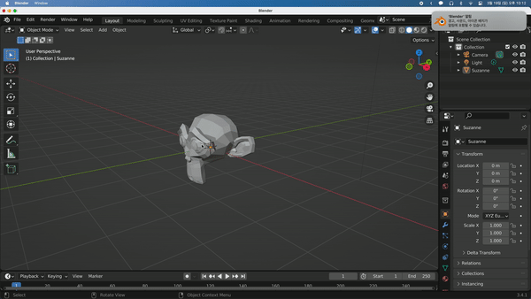

## Moving Around the Scene

기본적인 Blender Scene의 조작법을 소개하겠다.

Scene에서의 기본적인 회전(rotation)은 휠 드래그로 한다. (휠 클릭 후 마우스 이동)

Scene에서의 기본적인 이동은 Shift + 휠 드래그로 한다.

Scene에서의 확대 및 축소(줌 인, 줌 아웃)는 Ctrl + 휠 드래그 혹은 휠 업 / 휠 다운으로 한다.

---

numpad로 축 별 View를 볼 수 있다.

|                   |                     |                    |
| :---------------: | :-----------------: | :----------------: |
|  7 Top View   |   8 Rotate Up   |  9 Flip View   |
| 4 Rotate Left | 5 Persp / Ortho | 6 Rotate Right |
| 1 Front View  |  2 Rotate Down  |  3 Side View   |
|                   |  0 Camera View  |                    |

 

TKL 키보드에서는 numpad를 이용할 수 없기 때문에 설정에서 emulate해서 사용하기도 하지만, 그렇게 되면 Blender의 일부 기능을 제한할 수 있어서(확실하지는 않다.) 나는 Pie Menu로 사용할 예정이다.

