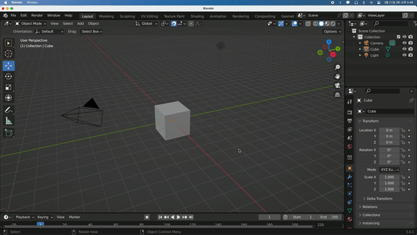
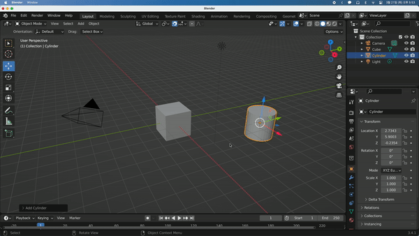
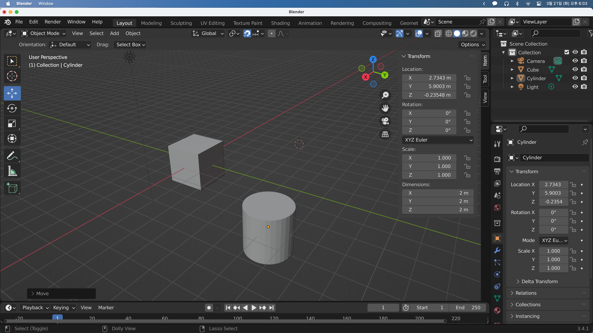

## Adding Objects

`Shift + 우클릭`을 하면 Cursor Location을 지정할 수 있고, `Shift + A`로 오브젝트를 추가할 수 있다.

오브젝트가 선택된 상태에서 Scene 좌특의 메뉴로 이동, 회전, 크기 변경 등을 할 수 있다. 좌측 Tool bar는 단축키 `T`를 통해 열고 닫을 수 있다.

또한 단축키로도 툴바의 기능을 사용할 수 있다. `G`로 이동, `S`로 크기 변경, `R`로 회전시킬 수 있고, 변경 중 `X`, `Y`, `Z`를 눌러 축을 제한해 줄 수도 있다.

또한 `N`키를 통해 정확한 수치를 확인하고 조정할 수 있다.

