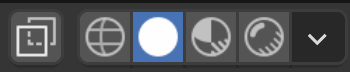
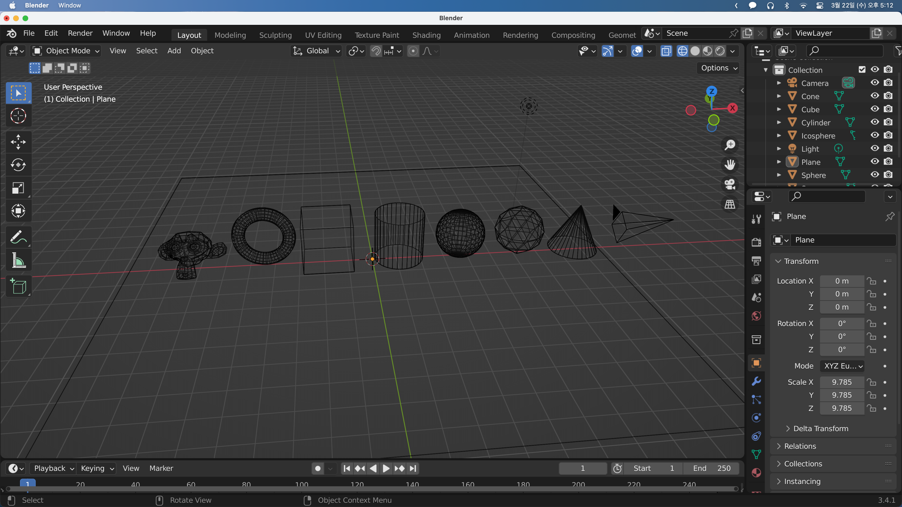
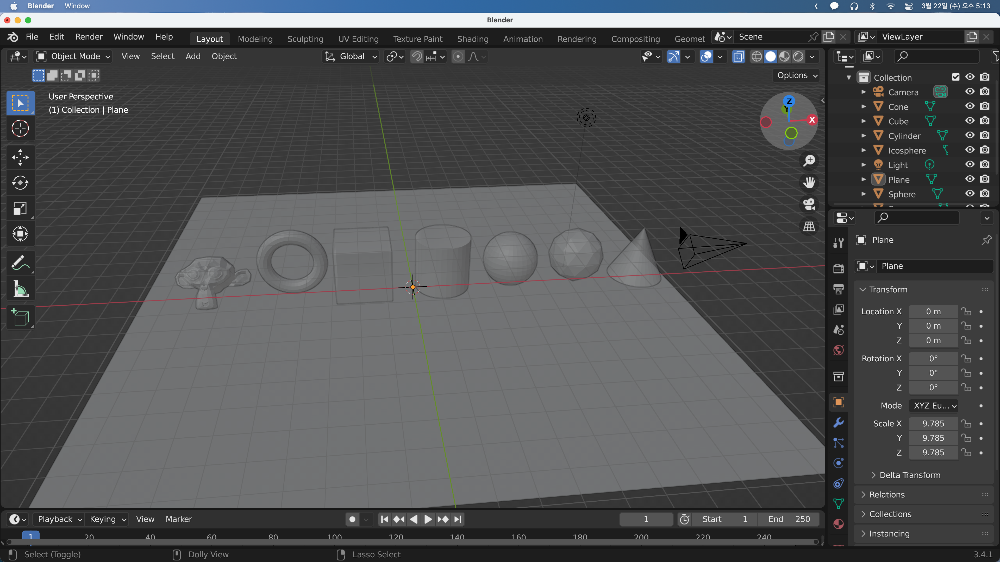
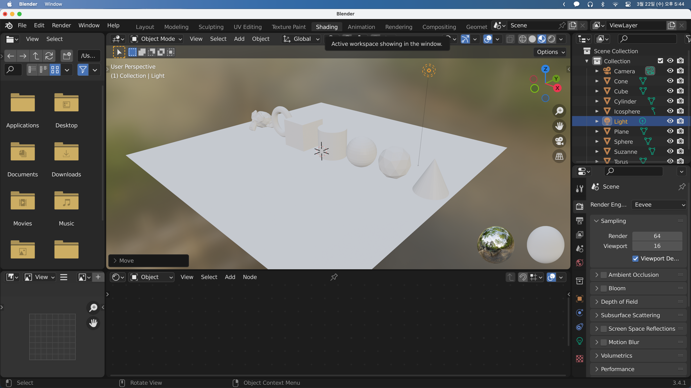
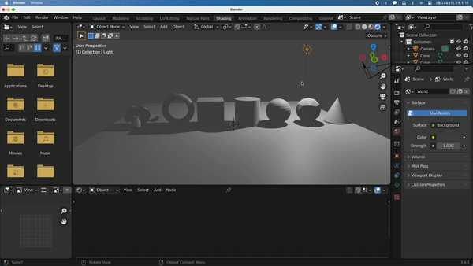
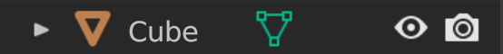
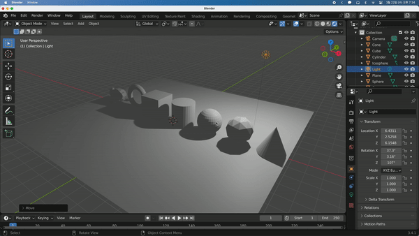

## Viewport and Rendering

오브젝트에 색이나 소재, 텍스처를 추가하려면 먼저 Blender가 Viewport에 있는 오브젝트를 어떻게 보여주는지와 렌더링을 어떻게 하는지를 고려해야 한다.

오른쪽 상단 모서리에 Viewport Shading 옵션이 있다.

기본으로는 Solid Mode이다. 이걸 Wireframe으로 바꾸면 다음과 같이 변한다. 사물을 편집하는 등 일렬로 놓고 반대편을 볼 때 유용할 수 있다.

가장 왼쪽의 버튼은 X-ray 옵션을 토글하는 기능이다. 이 옵션을 활성화하면 사물들이 반투명해져서 반대편에 있는 사물을 확인할 수 있고 와이어프레임보다 물체를 식별하기는 편해진다.

---

한편 Solid모드에서 물체를 살펴보면 회색에 명암이 들어가있는 상태인데 사실 이 명암은 물체를 3D로 볼 수 있도록 도와주기 위해 만든 가짜 명암이다. 실제로 Blender에서 light를 움직여봐도 명암이 바뀌지 않는 것을 알 수 있다.

다음 Material preview로 가보면 개체들이 기본 색상인 흰색으로 변하는 것을 볼 수 있다.

Material preview 모드는 어떤 형태의 조명을 사용하는데 이를 자세히 알아보기 위해 Shading 작업 영역으로 이동해보자.

씬 오른쪽 밑에 두 개의 구가 보이고, 배경에 흐릿한 이미지가 생겼다. 이는 HDRI (High Dynamic Range Image)라고 광폭 동적범위 이미지인데 밝은 부분과 어두운 부분은 물건에 조명을 비춰 자연스럽고 사실적인 조명을 얻을 수 있다.

창도 세개 생긴 것을 볼 수 있는데 밑은 오브젝트의 소재와 텍스처를 추가할 셰이더 에디터, 왼쪽은 이미지 편집기와 파일 브라우저이다. 이것들은 나중에 알아보도록 하고 light를 움직여보면 아직도 빛이 영향을 주지 못하는 것을 알 수 있다.

마지막은 Rendering Preview 모드이다. 최종 장면을 렌더링할 때 보게 되는데 여기서는 light를 움직이면 빛이 영향을 주는 것을 알 수 있다.

실제 렌더링 되는 화면을 볼 수 있다. Scene Collection을 보면 눈 모양과 카메라 모양이 있는데 눈 모양은 Scene에서 보일지 말지를 결정하고(렌더링 시는 상관없음) 카메라 모양은 렌더링 시 보일지 말지를 결정한다.

다음과 같이 눈 모양을 누른 경우 Scene에서는 보이지 않지만 `F12`를 눌러 렌더링했을 때 보이게 되고 카메라를 누른 경우 Scene에서는 보이지만 렌더링했을 때 보이지 않게 된다.

---

우측 하단 메뉴에서 카메라 버튼을 누르면 렌더링 설정 옵션창을 볼 수 있다. 렌더링 엔진으로 Eevee가 선택되어있는 것을 볼 수 있다. Eevee는 초고속 렌더링 시스템인데 현실과 완전히 똑같지는 않다. 이를 실제와 거의 유사한 Cycles로 바꿀 수 있다. 주로 Eevee와 Cycles 두 가지를 많이 사용한다. Cycles로 바꾸면 노이즈가 생겼다가 줄어드는 모습을 확인할 수 있다. 밑의 Device를 GPU로 바꾸면 더 빠르게 렌더링되는 모습을 볼 수 있다. Cycles는 Raytracing Renderer로 빛을 계산해 그림자를 생성한다.

작업할때는 보통 Eevee를 이용하고 렌더링시에는 Cycles를 이용하지만 성능이 좋지 못할 경우 렌더링에도 Eevee를 이용해도 된다.
