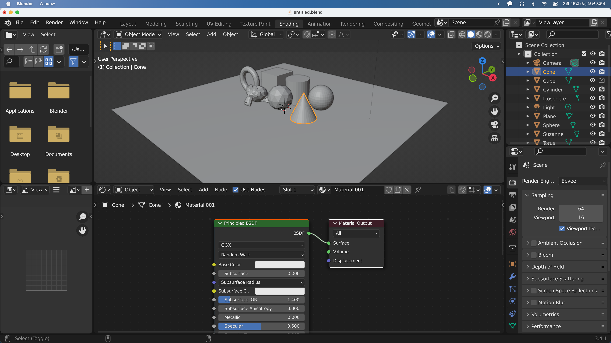
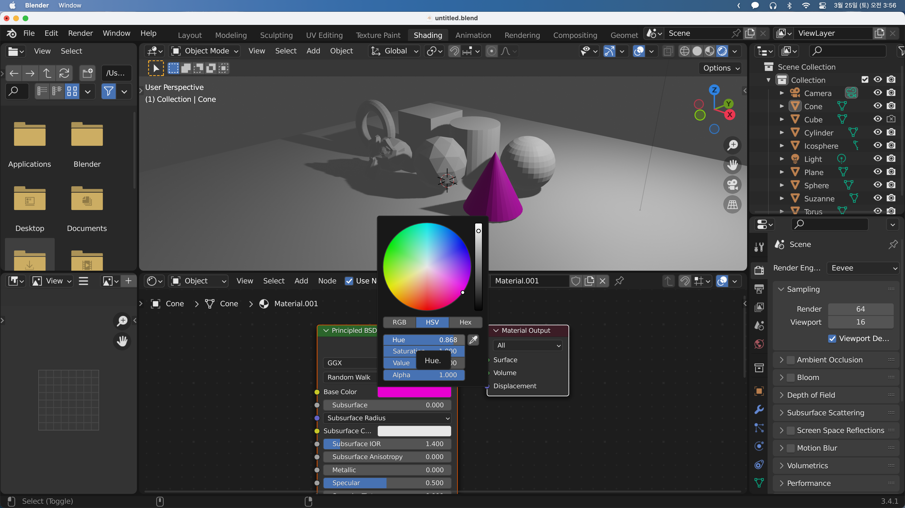
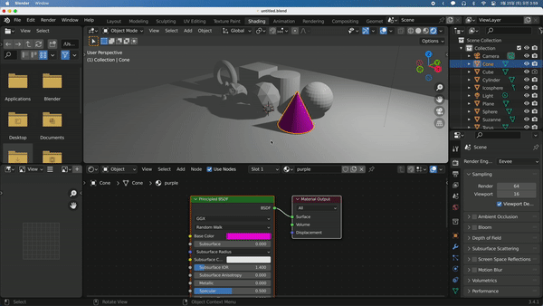

## Material Colors

다음으로 오브젝트에 색을 칠해볼 차례이다.
셰이더 창에서 New를 누르면 새로운 셰이더와 Material Output이 만들어진다.

셰이더의 Base Color를 클릭해 조정하면 오브젝트의 색을 변경할 수 있다.

셰이더 탭 상단에 Material.001를 눌러 이름을 변경할 수 있고, 다른 오브젝트에도 같은 셰이더를 등록할 수 있다. 같은 셰이더를 여러군데 적용한 상태에서 셰이더의 값이나 색을 변경하면 모든 오브젝트가 바뀌게 된다. 팔레트의 통이라고 생각하면 된다.

