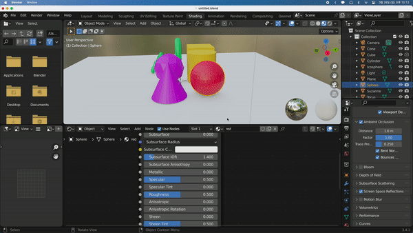
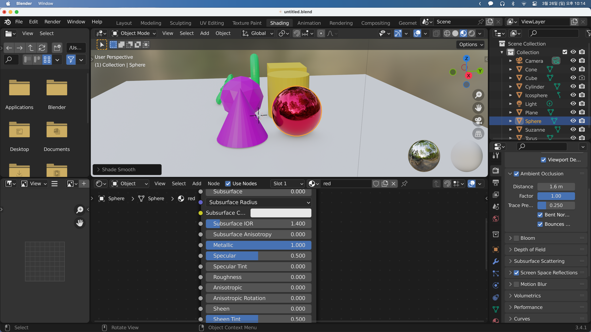
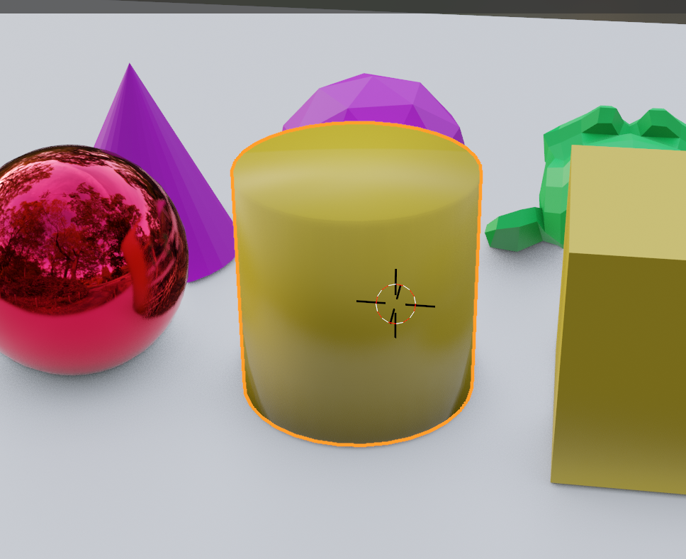
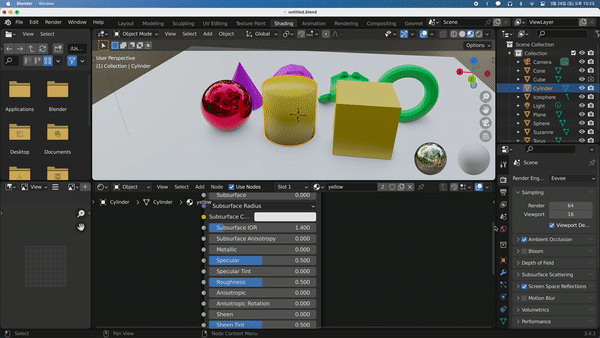
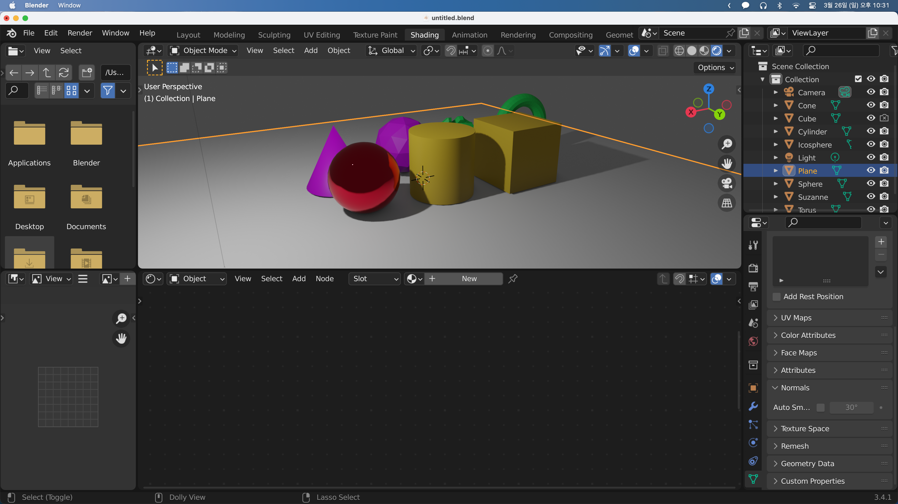
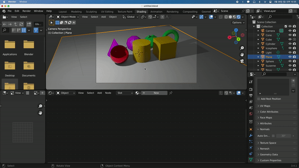

## Material Reflections

일단 먼저 Blender가 처음 로드될때는 빠른 로드속도를 위해 Solid Mode로 로드되지만 Material을 확인하기 위해서는 미리보기 모드로 바꾸어 주어야 한다.

먼저 세이더 편집 화면을 `Ctrl + Space`를 통해 전체화면으로 바꿔준다. 여기서 빛의 반사를 위해 바꾸어주어햐 할 것은 Metalness, Roughness, 그리고 Normal 탭이다.

Normal은 나중에 다루고 이번에는 Metalness와 Roughness를 살펴 볼 것이다.

Metalness를 올리면 물체가 빛을 반사하는 방식이 달라진다. 그리고 Roughness는 낮을수록 광택이 나고, 높을 수록 거칠고 칙칙해보인다.

또한 오브젝트를 우클릭해 Shade Smooth를 누르면 음영이 부드러워져 매끈한 구체가 된다.

Shade Smooth는 음영은 부드럽게 해주지만 오브젝트의 기하학적 구조를 바꾸지는 않는다. Cylinder를 예로들면 원통쪽은 부드러워야 하지만 위아래는 부드럽게 하면 안된다. Cylinder에 Shade Smooth를 적용하면 이렇게 된다.

이럴때는 우측 하단 패널의 Normal을 체크하면 된다. Normal에 설정한 각도 이상인 경우 뾰족하게 표시하고 각도 보다 작은 경우 부드럽게 변경해준다. Cylinder의 위아래가 뾰족하다가 90도가 넘어가는 순간 부드럽게 바뀌게 된다.

---

우리는 물체의 Metalness와 Roughness를 변경해 테스트해보았다. 하지만 이를 Rendering View에서 확인하면 이상하게 보인다. 이는 렌더링 뷰의 반사되는 배경이 회색이라 그렇다. 그래서 우리는 렌더링 뷰에 배경화면을 넣어주도록 하겠다.

셰이더 편집창의 좌측상단을 Object에서 World로 바꿔준다. 오브젝트때와 마찬가지로 Background의 Color를 클릭해 색을 바꿔줄수도 있지만 우리는 오픈소스 이미지를 추가해보겠다.

위쪽 메뉴의 Add - Texture - Environment Texture를 클릭해 추가하고 Texture의 Color와 Background의 Color를 이어준다. 그리고 Texture에 이미지를 Open해주면 된다.

이렇게 하면 Rendering View에서도 빛의 반사를 제대로 볼 수 있다.
