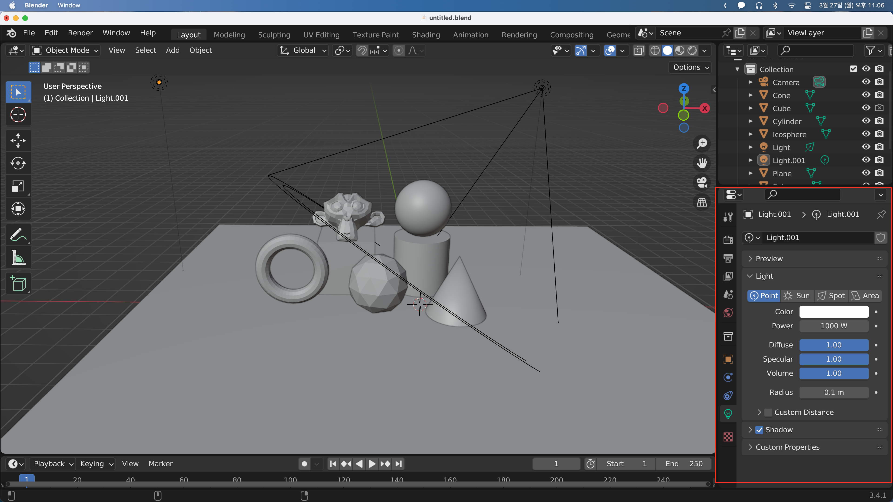

## Lighting

이번에는 Light에 대해 알아보겠다.
Light를 클릭하면 우측 하단의 Object Data property 아이콘이 전구모양으로 바뀐것을 볼 수 있다.

Point, Sun, Spot, Area의 네 가지 종류가 있다.
Color를 변경할 수 있고, Light의 Power 수치를 바꿀 수 있다.

Point Light는 기본 설정으로 한 점에서 사방으로 빛이 퍼져나간다.

Sun Light는 빛의 방향만 설정할 수 있다. 빛이 전역으로 비추게 된다.

SpotLight는 조명같이 원뿔 형태로 빛이 나가게 된다. Size로 원뿔의 크기를, Blend로 세개 비추는 영역을 설정할 수 있다.

Area는 판 형태의 조명으로 크기를 변경할 수 있다.

---

Shading 탭에서 World Background의 Strength를 낮춤으로 조명의 효과가 부각될 수 있다.

