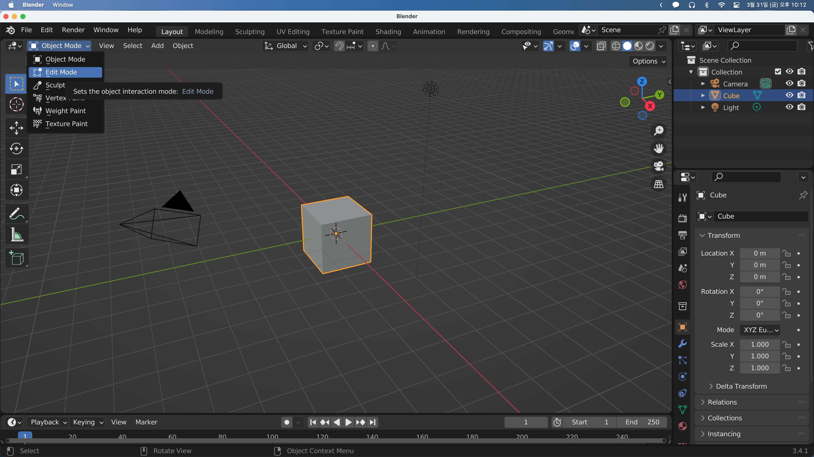

## Editing Objects

이번에는 기보적인 오브젝트를 편집하는 방법을 알아보겠다.

그러기 위해서는 일단 좌측 상단 드롭다운의 Object Mode를 Eidt Mode로 바꾸어 주어야 한다.

바꾸게 되면 상단과 좌측의 메뉴가 바뀐 것을 볼 수 있다.

그 중 우리가 살펴볼 것은 모드 선택 드롭다운 바로 우측에 있는 버튼들(점, 선, 면)이다.

기본적으로 점이 선택되어있고 실제로 오브젝트에서 각 점을 선택할 수 있다. 점을 하나 선택해 `G`를 누르면 점을 이동시킬 수 있고, `Shift + Click`을 통해 여러개의 점을 선택하고 `G`를 눌러 이동시킬 수도 있다. 물론 `R`로 Rotation, `S`로 Scale을 변경할 수도 있다.

여기서 점을 선으로 바꾸면 선을 선택할 수 있고, 면으로 바꾸면 면을 선택할 수 있게 된다. 키보드 `1, 2, 3`을 통해 점, 선, 면을 이동할 수 있다.

`E`를 눌러 돌출시킬 수 있다. 이때 주의해야 할 점은 내부로 들어가는 것과 같이 기하학적으로 겸치지 않게 해야한다는 것이다.

면의 절반만 돌출시키고 싶을 때에는 면을 잘라야 한다. 이 때는 루프 컷(Loop Cut)이라는 도구를 사용하면 되는데 단축키는 `Ctrl + R`이다. 자를 부분을 클릭하고 얼마나 자를 지 설정할 수 있다.(우클릭으로 넘어갈 수 있다.)

