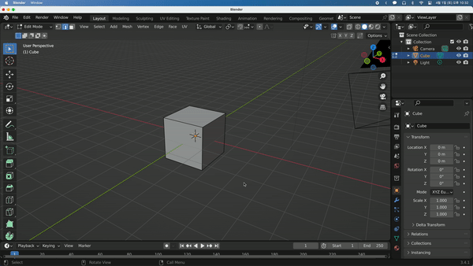
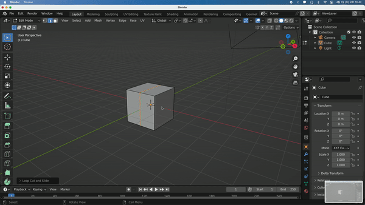
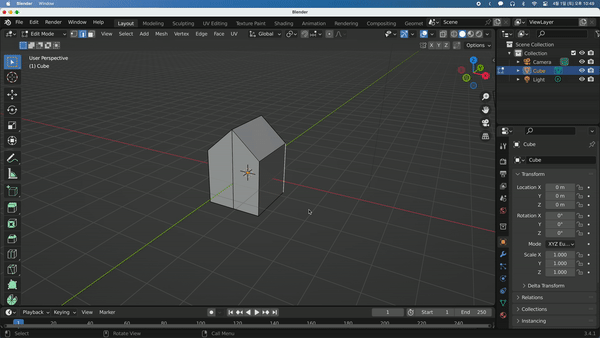

## Simple Houses

이번에는 간단한 집을 만들어보겠다.

주의해야 할 사항은 Edit Mode에서 `Shift + A`를 통해 Mesh를 추가한 경우 Edit하는 오브젝트에 추가되는 것이기 때문에 주의해야 한다. 만약 오브젝트에서 분리하고 싶은 경우 분리하고 싶은 Mesh에서 `P - By Loose Part`를 통해 분리시킬 수 있다.

`Alt + G`를 통해 위치값을 제거 (초기화)할 수 있고, `Alt + R`로 Rotation을, `Alt + S`로 Scale 값을 초기화할 수 있다.

다양한 모양의 집을 만드는 법을 소개하겠다.

