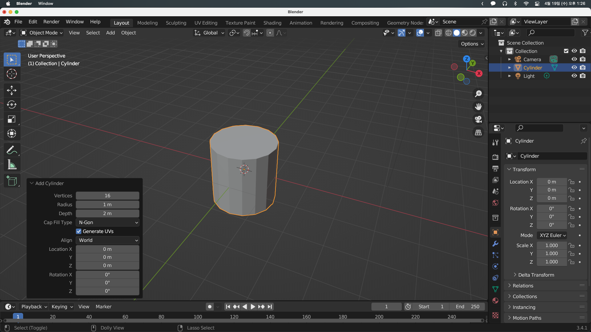
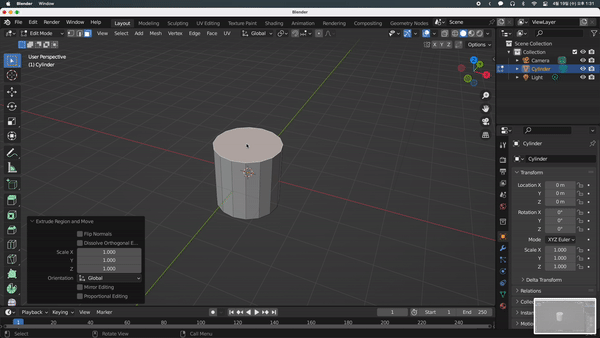
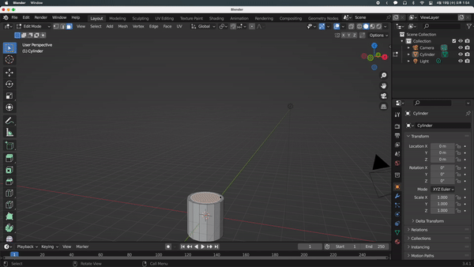
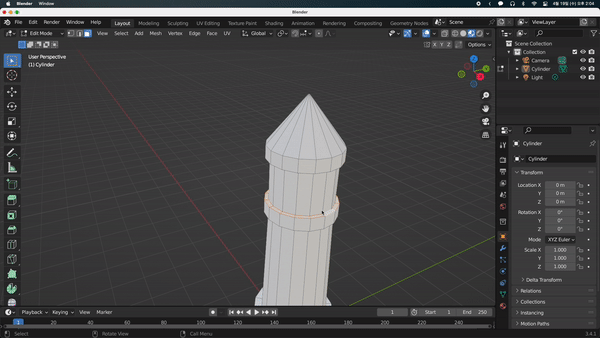

## Making a lighthouse

블렌더에서 그룹화를 하려면 컬렉션을 만들면 된다. 컬렉션을 만드는 방법에는 여러가지가 있다.

- 우측 상단 리스트에서 우클릭 후 새 컬렉션을 만든다. (우측 상단 리스트에서 더블클릭이나 `F2`로 이름을 변경할 수 있다)
- 뷰 포트에서 그룹으로 묶을 오브젝트들을 드래그로 선택한 뒤 (`control + 드래그`로 특정 구역을 뺄 수도 있다) `M`을 누른 뒤 New Collection을 선택한다.

보통의 경우 후자를 많이 사용한다.

간단한 등대를 만들어보겠다.
일단 실린더를 만들고 좌측 하단의 메뉴를 통해 Vertices를 16으로 만들어준다. (나중에 1/4만 할 수 있기 때문에 4의 배수로 해주는 것이 좋다)

실린더 윗면에서 `S`를 누르고 크기를 줄였을 때 원뿔처럼 바뀌지만 `E`를 누른 뒤 `S`를 통해 Inset 혹은 Outset을 할 수 있다.

다음과 같이 간단한 등대를 만든다. 마지막 윗부분은 scale을 0으로 줄여야 하는데 간단하게 `S - 0`으로 줄일 수 있다.

튀어나온 부분들을 맞추기 위해 `Alt + Edge Click`으로 테두리 면을 한꺼번에 선택할 수 있고 `G - Z`를 통해 두께를 조절할 수 있다. 튀어나온 크기를 조절하기 위해서는 `Alt + Click`을 통해 테두리를 선택하고, `S`를 눌러 크기를 조절하고, `Shift + Z`를 통해 Scale 을 Z 제외하고 조절할 수 있다.

