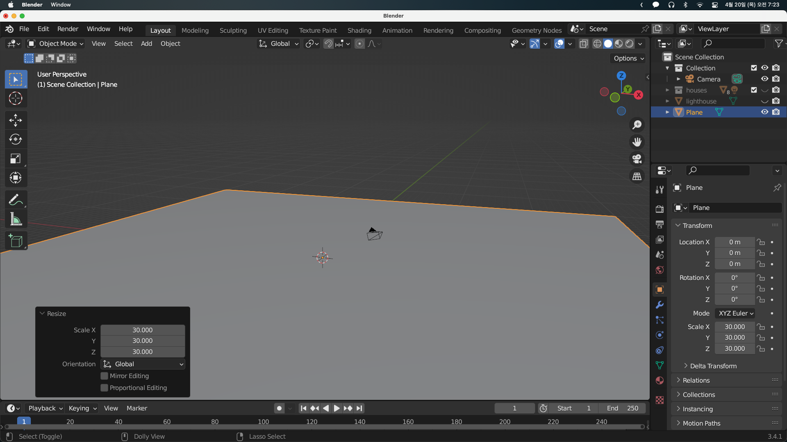
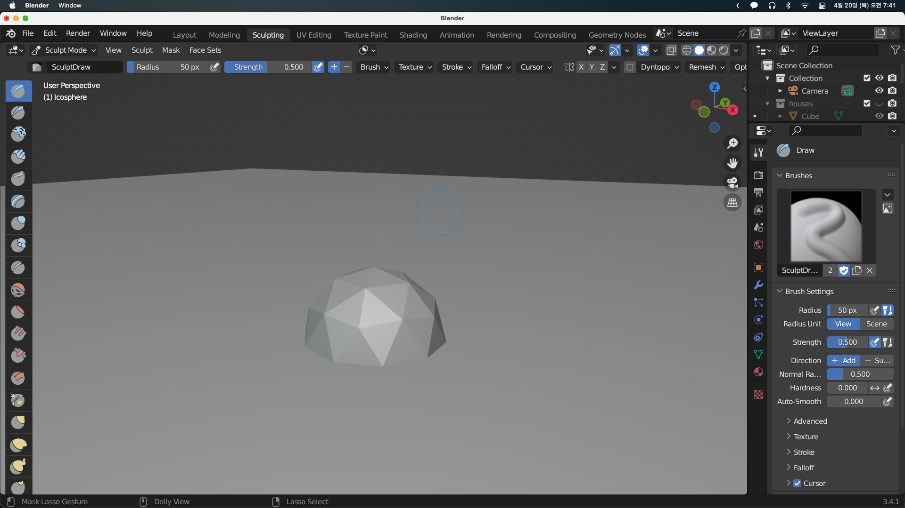
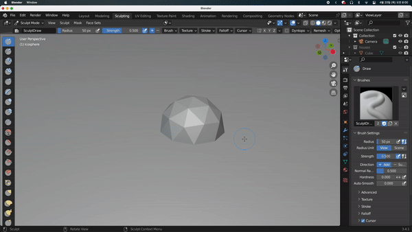
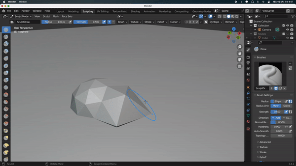
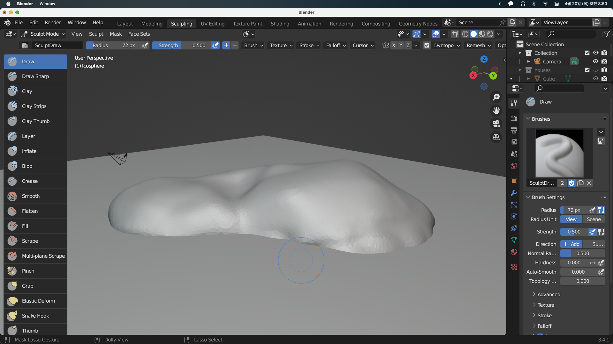

## Making a Rocky Base

기존에 만들었던 집들과 등대는 가려두고 등대 씬을 만들기 위해 밑바닥에 물을 깔아둔다

이 토대를 돌로 만들어보겠다. 이를 위해서 다른 모델링 기술을 사용해 볼 예정이다. 범위를 정하려면 시작 개체가 필요한데 3D 모델이어야 한다. Ico Sphere를 만들어준다.

상단에서 Sculpting 메뉴를 가면 좌측에 다양한 브러시를 볼 수 있다.

우측 하단에 다양한 메뉴가 있는데 오늘은 radius만 조절해볼 예정이다. 브러시 크기를 변경하려면 `F`를 누르고 마우스를 좌우로 움직이면 된다.

우측 상단의 Dyntopo를 체크해서 조각을 시작하면 모양이 변하는 것을 확인할 수 있다. `Tab`을 눌러서 편집모드로 가면 면들이 추가된 것을 볼 수 있다.

우측 상단의 메뉴에서 Detailing을 Constant Detail로 바꾸어 면을 일정하게 추가할 수 있다. 또한, 좌측의 Grab 브러시를 통해 쉽게 늘릴 수 있지만 면을 추가하지는 않는다. 그래서 Grab을 통해 늘린 후 다시 Draw 브러시를 사용해 면을 추가해주는것이 좋다.

다음과 같이 바닥의 돌 토대를 만들었다.

