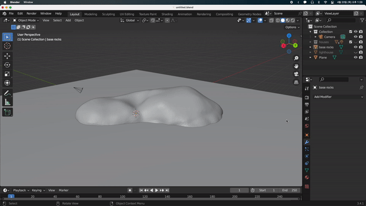
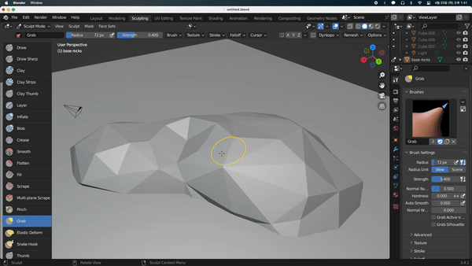
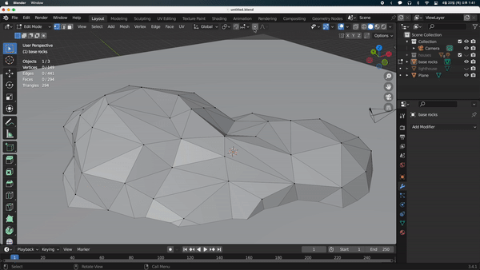

## the Decimate Modifier

이번에는 lowpoly 느낌을 주기위해 기본 암석의 폴리카운트를 줄여보겠다.
Layout 모드일때 우측 하단의 메뉴에서 Decimate Modifier를 추가한 뒤 Ratio를 줄여 폴리카운트를 줄일 수 있다.

그 후 드롭다운에서 Apply를 눌러줘야 적용이 된다. Edit 모드에서는 Apply가 비활성화된다.

이후 세부적인 조정은 두 가지 방법으로 할 수 있다.

- Sculpting 메뉴의 Grab 브러시에서 조정한다.

  

- Edit Mode에서 점 하나하나를 이동시켜서 조정할 수도 있다. Edit Mode에서 조정할 때는 상단의 비례 편집 버튼을 통해 영향력 원 내의 점들을 같이 비례하게 이동시킬 수 있다.

  
