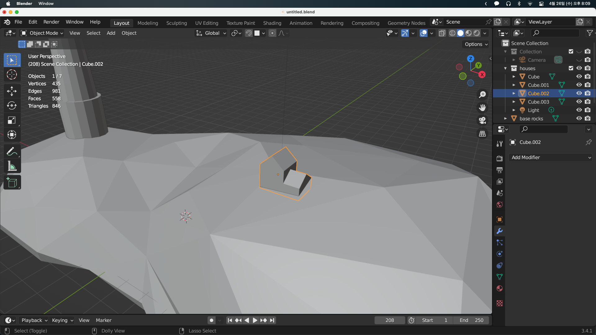
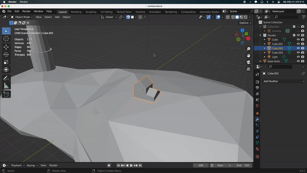
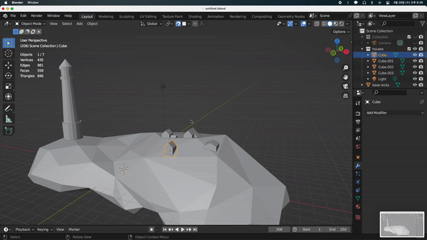
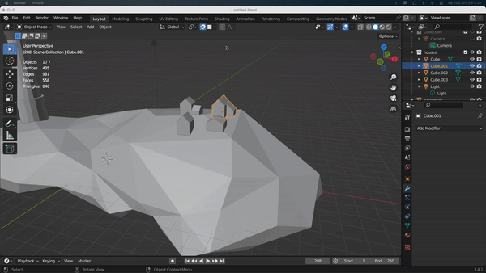

## Snapping

이전에 만들었던 돌 위에 등대와 집을 배치시켜 보겠다.

바위의 표면 위에 위치시켜야 하는데 공중에 뜨지 않고 적절하게 위치시키는데 시간이 걸린다. 이를 Snapping이라는 기능으로 해결할 수 있다. 집을 바위 표면 위에서 이동시킬 수 있다.

상단의 자석 모양의 버튼을 클릭하면 활성화할 수 있다. 그리드 형식으로 끊기면서 이동하는 것을 볼 수 있는데 `Snap to`를 `Face`로 선택하면 가장 가까운 표면 위에서 이동할 수 있는 것을 볼 수 있다.

하지만 정확히 원하는대로 이동하지 않고 예측할 수 없는 것을 볼 수 있다. 현재 `Snap with` 설정이 `Closest`로 되어있는데 이것을 `Center`로 바꿔주고 이동시켜보면 오브젝트의 중심점이 표면 위에서 이동하는 것을 볼 수 있다.

훨씬 더 만족스럽지만 집이 너무 깊게 들어가 있다. 따라서 우리는 집 오브젝트의 중심점을 이동시켜보겠다. 바꾸는 방법은 여러가지가 있다.

- 오브젝트 우클릭 후 `Set Origin` 설정에서 이동
- 우측 상단의 `Options`에서 `Affect Only`를 `Origis`로 변경 후 `G`로 이동
- `Edit Mode`에서 `A`로 모든 개체를 선택한 뒤 이동 (편집모드에서는 이동시켜도 중심점이 바뀌지 않는다.)

여러 개의 중심점도 한번에 옮길 수 있다.

또한, 지금은 사용하지 않겠지만 `Align Rotation to target` 옵션을 켜면 표면에 따라 rotation도 변경되게 된다.

`Project Individual Elements` 옵션을 체크하면, 여러 개의 오브젝트를 이동하더라도 각각 Snapping이 된다.
