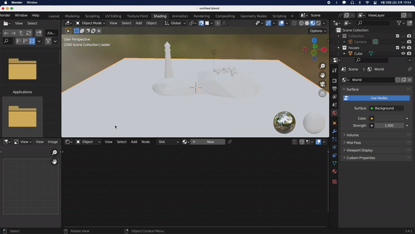
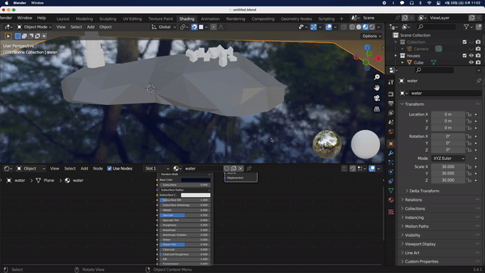
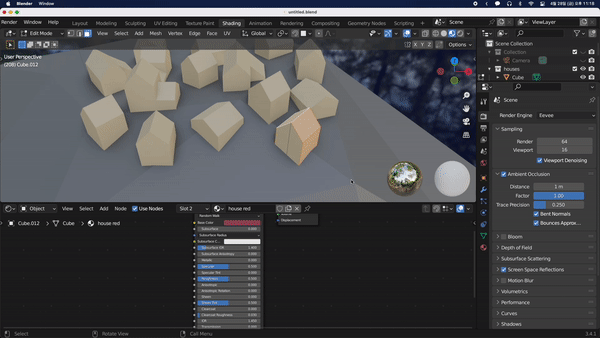
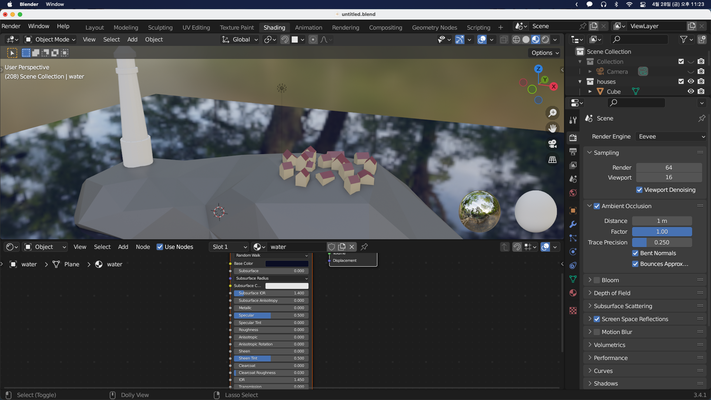

## Material Slots

이번에는 집을 색칠해보겠다. `Shading` 탭으로 이동한다.

3D Viewport 창과 Shader Editor 창을 왼쪽으로 합쳐준다. 그러기 위해서는 창 사이에 마우스를 대고 `+`모양일때 드래그를 통해 병합할 수 있다. 새로운 창을 만들고 싶은 경우에는 다시 `+`모양에서 드래그한 뒤 창을 바꿔주면 된다.

창을 기본값으로 돌리고 싶은 경우에는 위의 메뉴에서 `+`를 누른 뒤 `Add Workspace - General - Shading`을 눌러 기본값인 Workspace를 추가할 수 있고 기본의 Workspace를 우클릭해 삭제하면 된다.

이후 돌을 BaseColor가 회색인 Material로, 물을 BasoColor가 짙은 남색이고 Roughness가 0인 Material로 바꿔주고, 물의 경우 반사가 되야 하기 때문에 우측 하단 Render Property에서 `Screen Space Reflection`을 활성화시켜준다. `Ambient Occlusion`도 켜주고 `Distance`를 늘려 물체끼리 만나는 부분에 그림자를 만들어줄 수 있다.

집의 경우에는 지붕과 벽이 서로 다른 색의 Material이어야 하기 때문에 집들을 일단 살짝 노란 Material로 바꿔주고 Material 왼쪽의 Slot에 빨간 지붕 Material을 만들어준다. 이후 편집모드에서 지붕을 선택한 뒤 슬롯에서 빨간색을 선택 후 `Assign`을 눌러 적용해준다.

집들에 Material이 적용된 것을 볼 수 있다.

