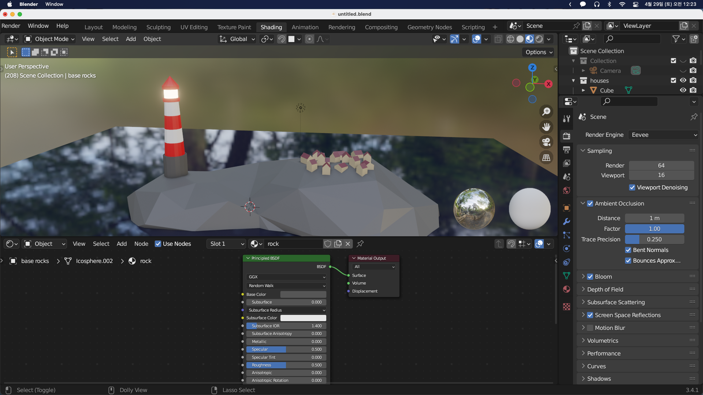

## Lighthouse Materials

다음은 등대를 색칠할 차례이다. 먼저 4개의 슬롯을 만든 뒤 세 개의 슬롯에 흰색, 빨간색, 회색의 Material을 할당해준다.

마지막 Material을 만들어준 뒤 밑의 Emission을 설정해 줄 예정인데 먼저 확인하기 위해 등대에 먼저 적용해준다. `Edit Mode`에서 `Alt + Click`으로 테두리를 선택하고 Assign해준다. Emission 색을 노란 색으로 변경해주고 `Emission Strength`를 올려준다. Eevee에서는 실제로 빛을 발산하지 않지만 그렇게 보이게 하기 위해 `Render Property`의 `Bloom`을 활성화시켜준다.

줄무늬의 형태로 칠해주기 위해 `Edit Mode`에서 `Ctrl + R`을 누른 뒤 휠업으로 세번 잘라준다.

`Alt + Click`으로 테두리를 선택한 뒤 그 위아래도 선택하고 싶은 경우 위아래를 `Shift + Alt + Click`또는 Numpad가 있는 경우 `Ctrl + +(numpad)`를 통해 확장할 수 있다. 위의 메뉴에서 `Select - Select Mode/Less - More`을 선택해도 같은 동작을 할 수 있다.

다음과 같이 등대도 색칠을 완료했다.

