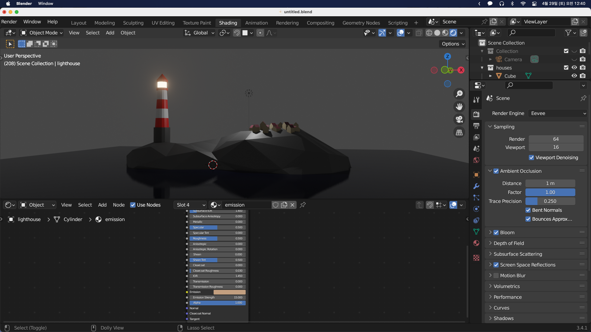
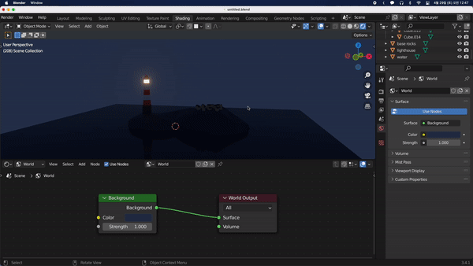
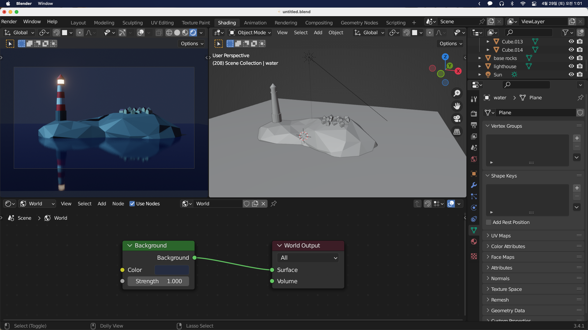
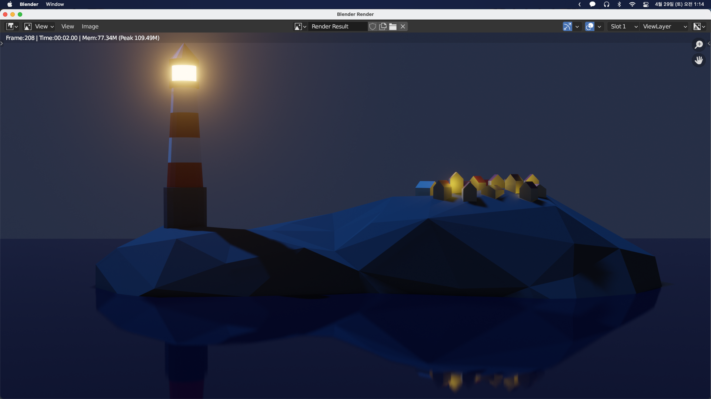

## Lighting and Atmosphere

렌더링을 하기 위해 Render View로 확인해본다.

지금도 나쁘지는 않지만 너무 회색빛이 도는 걸 볼 수 있다. 좌측 위의 Object를 World로 바꿔주고 `Home`을 누르면 노드들을 한번에 볼 수 있다. `Background`의 `Color`를 어두운 남색으로 바꿔준다.

등대의 빛만 있으면 집들이 잘 보이지 않기 때문에 `Shift + A` 를 눌러 Sun light를 추가해준다. `G`를 눌러 위로 올려주고 방향, 색, 세기를 설정해준다.

값들을 설정할 때 최종 렌더링 뷰에 어떻게 보이는지가 중요하기 때문에 렌더링 화면을 추가해보도록 하겠다. 카메라 뷰로 간 후 `N`을 누르고, `ViewLock - Lock`의 `Camera to View`를 활성화시켜 카메라 위치를 조정해준다. 조정한 뒤에는 `Camera to View`옵션을 꺼준다.

카메라 뷰가 생겼지만 화면을 이동시킬 때마다 다시 돌아와서 확인하는 것이 번거로울 수 있으니 창을 하나 더 만들어보겠다.
카메라 뷰에서는 오버레이와 기즈모도 꺼준다.

이제 작업을 하면서 동기에 카메라 뷰를 볼 수 있다.

돌이 반짝이는 경향이 있으니 Rock material의 Roughness를 올려준다.

집안의 조명 효과를 내기 위해 집쪽에 `Shift + Right Click`이후 `Shift + A`로 `Point Light`를 추가해준다. `Alt + D`를 통해 링크된 복사본들을 집집마다 설치해주고 색을 노란색으로 맞춰준다. 밝기도 적절히 조절해준다.

이제 렌더링 할 일만 남았다. 렌더링 옵션에서 Ambient Occlusion과 Bloom의 값들을 조절해주고 `F12`로 최종 렌더링 상태를 확인한다.

