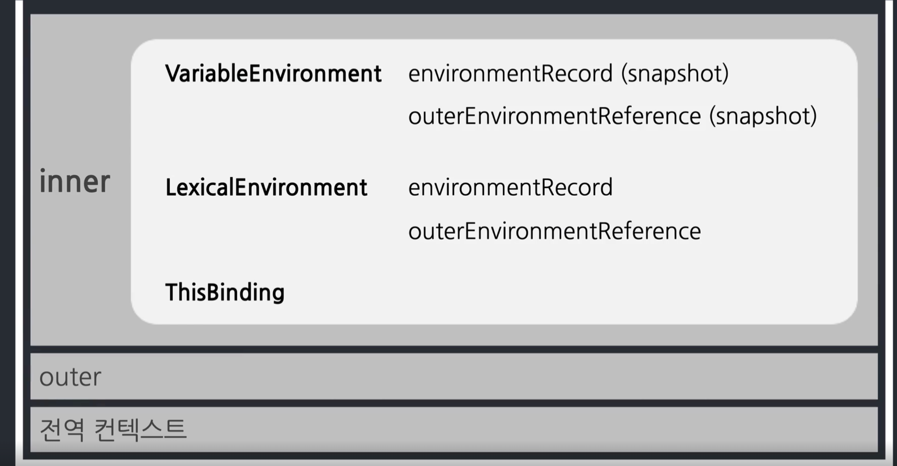
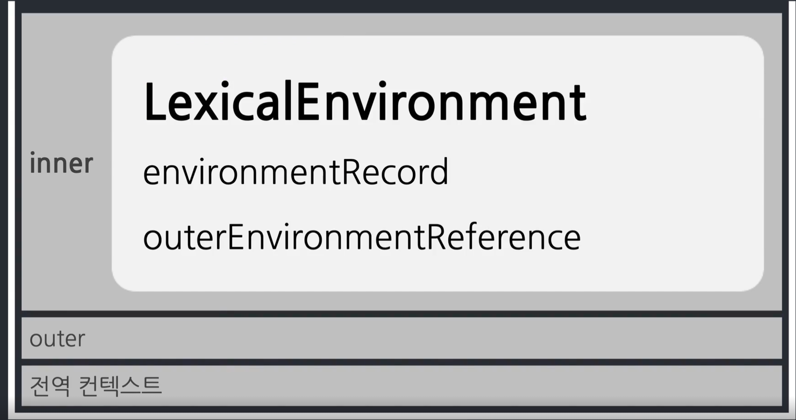
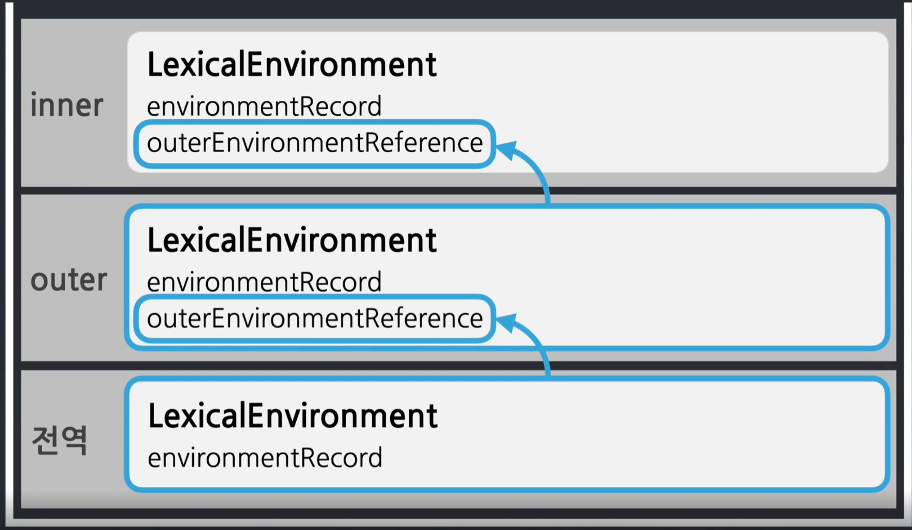

# 실행 컨텍스트 (Execution Context)

## Execution Context란?

실행 문맥/맥락/환경, 코드의 배경이 되는 조건, 환경정도
코드를 실행할 때 영향을 주는 주변 코드나 변수들

## 자바스크립트에서 동일한 조건을 지닐 수 있는 조건

<details>
<summary>정답</summary>

- 전역 공간
- 함수
- eval
- module

### 따라서 실행 Context는 함수를 실행할 때 필요한 조건, 환경정보를 담은 객체이다.

</details>

```js
var a = 1;
function outer() {
  console.log(a); // 1

  function inner() {
    console.log(a); // 2
    var a = 3;
  }

  inner();

  console.log(a); // 3
}

outer();
console.log(a); // 4
```

<details>
<summary>정답</summary>

- 실행 순서: 1, 2, 3, 4
- 출력값
</details>

## Callstack

현재 어떤 함수가 동작중인디, 다음에 어떤 함수가 호출될 예정인지 등을 제어하는 자료구조
|callstack|
|---|
|inner|
|outer|
|전역|

## 실행 Context의 내부




## Lexical Environment란?

- 어휘적/사전적 환경
- 실행 컨텍스트를 구성하는 환경 정보들을 모아 사전처럼 구성한 객체

```
예시)
a: undefined
b: 20
외부 정보: D 참조
```

- environmentRecord
  - 현재 문맥의 식별자 정보
  - <details>
    <summary>현재 컨텍스트 식별자 정보들을 수집해서 Environment에 담는 과정</summary>
    hoisting: 식별자 정보를 끌어올린다. 실행 컨텍스트의 제일 위로.
    </details>
- outerEnvironmentReference:

```js
console.log(a());
console.log(b());
console.log(c());

function a() {
  return "a";
}
var b = function bb() {
  return "bb";
};
var c = function () {
  return "c";
};
```

<details>
<summary>호이스팅 이후</summary>

```js
function a() {
  return "a";
}
var b;
var c;
console.log(a());
console.log(b());
console.log(c());

function a() {
  return "a";
}
var b = function bb() {
  return "bb";
};
var c = function () {
  return "c";
};
```

</details>

<details>
<summary>EnvironmentRecord</summary>

```js
{
  function a() { ... },
  b: undefined,
  c: undefined
}
```

</details>

## OuterEnvironmentReference

- 현재 문맥에 관련 있는 외부 식별자 정보
- 외부의 LexicalEnvironment에 대한 참조
- Scope chain



```js
var a = 1;
function outer() {
  console.log(a);

  function inner() {
    console.log(a);
    var a = 3;
  }

  inner();

  console.log(a);
}

outer();
console.log(a);
```

<details>
<summary>정답</summary>
```js
1
undefined
1
1
```
</details>

## 결론

### `Execution Context`는 함수를 실행할 때 필요한 환경정보를 담은 객체

### `Variable Environment`와 `Lexical Environment`, `this`로 구성

### Lexical Environment는 `environmentRecord(현재 문맥의 식별자, hoisting)`와 `outerEnvironmentReference(외부 식별자, scope chain)`으로 구성된다.
