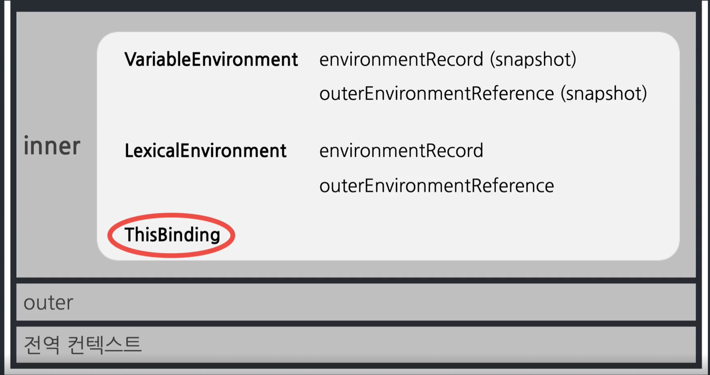

# This

## This 바인딩은 언제 된다?



- 실행 컨텍스트가 활성화될 때 한다.
- 실행 컨텍스트가 언제 활성화된다? 함수가 호출될 때
- 호출하는 방식에 따라 다르다.

## 호출하는 방식

- 전역 공간에서
- 함수 호출 시
- 메서드 호출 시
- callback 호출 시
- 생성자함수 호출 시

## 전역 공간에서

- 브라우저는 window, node.js에서는 global 객체 (전역 객체)

## 함수 호출 시

- window/global

```js
function a() {
  console.log(this);
}
a();
```

- 함수를 전역에서 실행했을 때 실행 주체가 누구냐? 전역객체

```js
function b() {
  function c() {
    console.log(this);
  }
  c();
}
b();
```

```js
var d = {
  e: function () {
    function f() {
      console.log(this);
    }
    f();
  },
};
d.e();
```

<details>
<summary>정답</summary>
- 언제나 전역 객체를 가리킨다.
</details>

### 메서드 호출 시

- 메서드 호출 주체 (메서드 명 앞)

```js
var a = {
  b: function () {
    console.log(this);
  },
};
a.b();

var a = {
  b: {
    c: function () {
      console.log(this);
    },
  },
};
a.b.c();
```

- 자바스크립트에서는 클래스에 선언되어있지 않더라도 인스턴스(객체)와 관련된 동작을 하게 되면 메서드라고 본다.

```js
obj.func();
obj["func"]();

person.info.getName();
person.info["getName"]();
person["info"].getName();
person["info"]["getName"]();
```

## 메서드 내부함수에서의 우회법

- 기존 코드

```js
var a = 10;
var obj = {
  a: 20,
  b: function () {
    console.log(this.a);

    function c() {
      console.log(this.a);
    }

    c();
  },
};

obj.b();
```

- 우회법

```js
var a = 10;
var obj = {
  a: 20,
  b: function () {
    var self = this; // \_this
    console.log(this.a);

    function c() {
      console.log(self.a);
    }

    c();
  },
};

obj.b();
```

- 명시적인 this 바인딩 (call / apply) 활용 (ES5)

```js
var a = 10;
var obj = {
  a: 20,
  b: function () {
    console.log(this.a);

    function c() {
      console.log(this.a);
    }

    c.call(this);
  },
};
obj.b();
```

- Arrow Function 활용 (ES6)

```js
var a = 10;
var obj = {
  a: 20,
  b: function () {
    console.log(this.a);

    const c = () => {
      console.log(this.a);
    };

    c();
  },
};
obj.b();
```

## Callback 호출 시

- 기본적으로는 함수 내부에서와 동일

## call, apply, bind

```js
function a(x, y, z) {
  console.log(this, x, y, z);
}

var b = {
  bb: "bbb",
};

a.call(b, 1, 2, 3);

a.apply(b, [1, 2, 3]);

var c = a.bind(b);
c(1, 2, 3);

var d = a.bind(b, 1, 2);
d(3);
```

```
{bb: "bbb"}, 1, 2, 3
```

<details>
<summary>함수 정의</summary>

```js
func.call(thisArg[, arg1[, arg2[, ...]]])
func.apply(thisArg, [argsArray])
func.bind(thisArg[, arg1[, arg2[, ...]]])
```

</details>

## 콜백 함수에서의 this

```js
var callback = function () {
  console.log(this);
};

var obj = {
  a: 1,
  b: function (cb) {
    cb();
  },
};

obj.b(callback);
```

<details>
<summary>정답</summary>

window

</details>

```js
var callback = function () {
  console.log(this);
};

var obj = {
  a: 1,
  b: function (cb) {
    cb.call(this);
  },
};

obj.b(callback);
```

<details>
<summary>정답</summary>

obj

</details>

- 그때그때 다르다.

```js
var callback = function () {
  console.log(this);
};

var obj = {
  a: 1,
};

setTimeout(callback, 100); // window
setTimeout(callback.bind(obj), 100); // obj
```

```js
document.body.innerHTML += '<div id="a">클릭</div>';

document.getElementById("a").addEventListener("click", function () {
  console.log(this);
});

// HTML DOM Element
```

### 정리

- 기본적으로는 함수의 this와 같다.
- 제어권을 가진 함수가 콜백의 this를 지정해둔 경우도 있다.
- 이 경우에도 개발자가 this를 바인딩해서 콜백을 넘기면 그에 따른다.

## 생성자 함수 호출 시

- 인스턴스

```js
function Person(n, a) {
  this.name = n;
  this.age = a;
}
var roy = Person("재남", 30);
console.log(roy.name);
```

<details>
<summary>정답</summary>

{.warning}
VM359:1 Uncaught TypeError: Cannot read properties of undefined (reading 'name')

</details>

```js
function Person(n, a) {
  this.name = n;
  this.age = a;
}
var roy = Person("재남", 30);
console.log(roy.name);
// 재남
```

## 정리
|호출방식|this|
|---|---|
|전역 공간에서|window/global|
|함수 호출 시|window/global|
|메서드 호출 시|메서드 호출 주체(메서드명 앞)|
|callback 호출 시|기본적으로는 함수 내부에서와 동일|
|생성자함수 호출 시|인스턴스|
