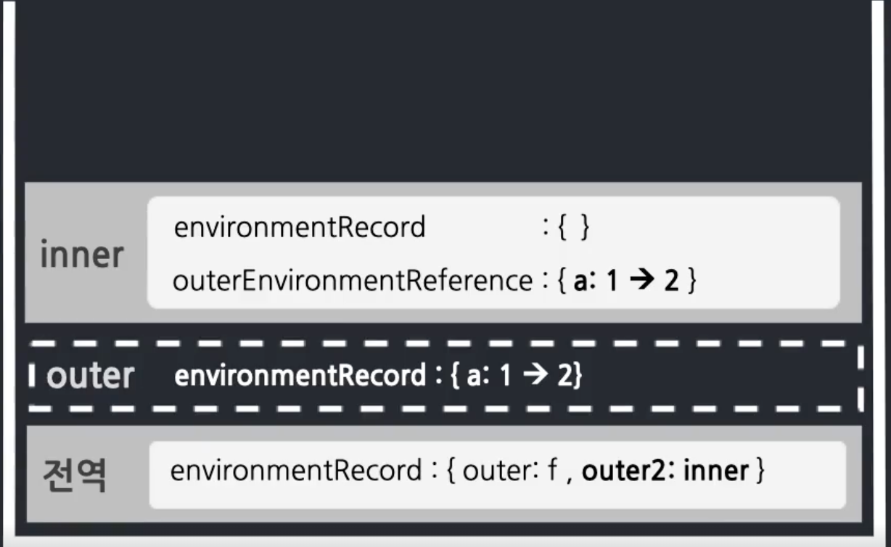

# 클로저 (closure)

## closure란?
- 단어의 사전적 의미: 닫힘, 폐쇠, 완결성
- MDN 정의: A closure is the combination of a function bundled together (enclosed) with references to its surrounding state(the lexical environment)
- 클로저란 어떤 combination(결합/조화/조합), 에워싸여 함께 묶어진 함수, 둘러쌓인 lexical environment의 참조
- 내부함수와 lexicalEnvironment의 조합
- A의 lexical environment와 내부함수 B의 조합 (함수가 생성될때마다 발생)
- 하지만 보편적으로 사용하지는 않고 클로저에만 적용되는 `특별한 현상`을 사용할 때 클로저하는 단어를 사용한다.


- `컨텍스트 A`에서 선언한 `변수`를 `내부함수 B`에서 `참조`할 경우에 발생하는 특별한 현상


## 예제

```js
var outer = function() {
  var a = 1;
  var inner = function () {
    console.log(++a);
  }
  inner();
}
outer();
```


```js
var outer = function() {
  var a = 1;
  var inner = function () {
    return ++a;
  }
  return inner;
}
var outer2 = outer();
console.log(outer2());
console.log(outer2());
```



- `컨텍스트 A`에서 선언한 `변수 a`를 `참조`하는 `내부함수 B`를 `A`의 `외부로 전달`할 경우, `A`가 종료된 이후에도 `a`가 `사라지지 않는` 현상
- `지역변수가 함수 종료 후에도 사라지지 않게 할 수 있다`
- 함수 종료 후에도 사라지지 않는 지역변수를 만들 수 있다.

```js
function user(_name) {
  var _logged = true;
  return {
    get name() { return _name },
    set name(v) { _name = v },
    login() { _logged = true },
    logout() { _logged = false },
    get status() {
      return _logged
        ? 'login'
        : 'logout';
    },
  }
}
var roy = user('재남');

console.log(roy.name);
roy.name = '제이';
console.log(roy.name);

roy._name = '로이';
console.log(roy.name);

console.log(roy.status);

roy.logout();
console.log(roy.status);

roy.status = true;
console.log(roy.status);
```
<details>
<summary>정답</summary>

```
재남
제이
제이
login
logout
logout
```

</details>

## 결론
1. 함수 종료 후에도 사라지지 않고 값을 유지하는 변수
2. 외부로부터 내부 변수 보호 (캡슐화)

## 공부할 내용
1. 클로저에 의한 메모리 누수를 관리하는 방법 (null 혹은 undefined 할당)
2. 클로저를 활용한 프로그래밍 기법 (접근 권한 제어, 부분 적용 함수, 커링 함수)