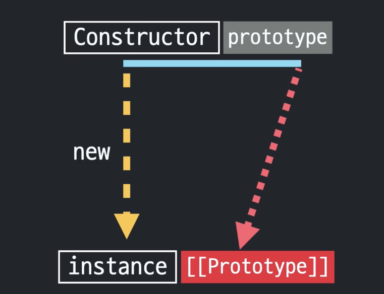

# 프로토타입 (Prototype)

## prototype, \[\[Prototype\]\], constructor



- constructor.prototype = instance.\[\[Prototype\]\]
- \[\[Prototype\]\] (프로토)는 접근 가능한 것이 아니라 정보를 보여주기만 할 뿐으로, 실제 동작상으로는 instance와 동일시된다.

### 예제 1
```js
[1, 2, 3]
```
- 배열이 있다. 리터럴로 생성한 배열이든, Array 생성자함수로 생성한 배열이든, 내부 구조는 모두 Array 생성자 함수로 생성한 것과 동일하게 동작한다.
- 생성자로 생성한 경우에 생성자 함수는 `Array`이고, Array라고 하는 함수에는 from(), isArray(), of(), arguments, length, name, prototype 과 같은 프로퍼티들이 존재한다.
- 이 중 `prototype`이라고 하는 property가 이 배열 리터럴의 `[[Prototype]]`로 연결이 되어 있는 것이다.
- Array의 prototype 프로퍼티는 객체인데 이 객체에는 concat(), filter(), forEach(), map(), push(), pop(), ...등과 같은 배열 메서드들이 담겨있다.

```
console.dir([1, 2, 3]);
```
```
Array(3)
0: 1
1: 2
2: 3
length: 3
[[Prototype]]: Array(0)
```

- Array.prototype.constructor = [1, 2, 3].constructor
- [1, 2, 3].constructor
- [1, 2, 3].\[\[Prototype\]\].constructor (실제 접근 불가)
- Array.prototype.constructor
- Array

### 예제 2
```js
10
```
- 다음과 같이 숫자 리터럴 10은 객체가 아니므로 \[\[Prototype\]\] 프로퍼티가 존재하지 않는다.

```js
10.toFixed(2);
```
- 그런데도 개발자가 리터럴을 인스턴스인 것처럼 사용하려고 하면 (메서드를 사용하려고 하면) 자바스크립트가 임시로 숫자 리터럴에 해당하는` Number 생성자 함수의 인스턴스`를 만들어서 그 프로토타입에 있는 메서드를 적용해서 원하는 결과를 얻게 한 다음에 `다시 인스턴스를 제거하는 식`으로 동작한다.
- `문자열`도 마찬가지이다.
- 결국 숫자형이든, 문자열이든, 배열이든, 함수든 할 것 없이 모두 메서드에 접근하고자 할 때에는 이런 구조로 데이터 자체에는 메서드가 없지만 `생성자의 prototype`에 있는 것을 `[[Prototype]]`라는 통로에 의해서 자신의 것처럼 사용할 수 있다.
- null과 undefined를 제외한 모든 데이터타입은 이와 같은 생성자 함수가 존재한다.
- 각 생성자의 prototype에는 각 데이터 타입에만 해당하는 전용 메서드가 정의되어있다.

### \[\[Prototype\]\]

- \[\[Prototype\]\]이라는 프로퍼티는 콘솔에 표시가 되는 내용일 뿐이고, 실제로 이 프로퍼티를 이용해서 prototype에 직접 접근할 수는 없다.
- 실제로 인스턴스로부터 접근하려면 두 가지 방법이 있다.
> - instance.\_\_proto\_\_ (콘솔에는 찍히지 않지만 접근 가능, 기존 브라우저 기능이라 호환성 때문에 사용 가능한 것이지 공식적인 방법이 아니라 추천X)
> - Object.getPropertyOf(instance) (공식적인 방법)

### 정리
```js
function Person(n, a) {
  this.name = n;
  this.age = a;
}

var roy = new Person('로이', 30);

var royClone1 = new roy.__proto__.constructor('로이_클론1', 10);

var royClone2 = new roy.constructor('로이_클론2', 25);

var royClone3 = new Object.getPrototypeOf(roy).constructor('로이_클론3', 20);

var royClone4 = new Person.prototype.constructor('로이_클론4', 15);
```
- prototype에 접근하는 방법들
```js
instance.__proto__
instance
Object.getPrototypeOf(instance)
Constructor.prototype
```
- constructor에 접근하는 방법들
```js
Constructor
instance.__proto__.constructor
instance.constructor
(Object.getPrototypeOf(instance)).constructor
Constructor.prototype.constructor
```

## 메서드 상송 및 동작 원리

```js
function Person(n, a) {
  this.name = n;
  this.age = a;
}

var roy = new Person("로이", 30);
var jay = new Person("제이", 25);

roy.setOlder = function() {
  this.age += 1;
}
roy.getAge = function() {
  return this.age;
}
jay.setOlder = function() {
  this.age += 1;
}
jay.getAge = function() {
  return this.age;
}
```
- 같은 메서드를 선언하면 중복코드가 늘기 때문에 프로토타입으로 메서드 선언
```js
function Person(n, a) {
  this.name = n;
  this.age = a;
}
Person.prototype.setOlder = function() {
  this.age += 1;
}
Person.prototype.getAge = function() {
  return this.age;
}

var roy = new Person("로이", 30);
var jay = new Person("제이", 25);
```
- 코드의 중복을 피하면서 각각의 인스턴스는 생성자의 프로토타입을 참조만 하기 때문에 메모리 사용도 최적화 할 수 있고 객체지향적 관점에서도 특정 집단의 공통 된 속성을 파악할 수 있기 때문에 이득이다.

## Prototype Chaining

## Prototype Chaining이란
- 생성자의 Prototype 프로퍼티도 객체이기 때문에 Object의 생성자를 통해 만들어지고 `Object의 prototype 프로퍼티`를 참조하게 된다.
- 따라서 생성된 인스턴스는 생성자의 prototype 뿐만 아니라 Obejct 객체의 prototype에 있는 메서드도 자신의 것인 것처럼 사용할 수 있다.
- 이러한 것을 `프로토타입 체이닝`이라고 부른다.
- 모든 프로토타입은 `Object.prototype`과 프로토타입 체인으로 연결되어있다.
- Object.prototype에는 자바스크립트 전체를 통괄하는 공통된 메서드들, `hasOwnProperty(), toString(), valueOf(), isPrototypeOf()` 등의 공통된 메서드들이 정의되어있다. 이 메서드들은 프로토타입 체이닝에 의해 `모든 객체에서 사용`할 수 있다.

## Object Prototype
- 오브젝트의 프로토타입 메서드는 모든 객체에서 사용할 수 있기 때문에 오브젝트만의 메서드를 정의할 수 없다.
- 따라서 오브젝트는 오브젝트만의 메서드들을 프로토타입 대신에 생성자에 정의해두었다.
- 따라서 오브젝트만의 메서드를 사용할 때에는 Object.명령어를 호출하면서, 그 매개변수로 객체 자신을 넘겨주는 방식을 취하는 경우가 많다.
- ~~obj.freeze();~~  => Object.freeze(obj);
- ~~obj.keys();~~  => Object.keys(obj);
- ~~obj.values();~~  => Object.values(obj);