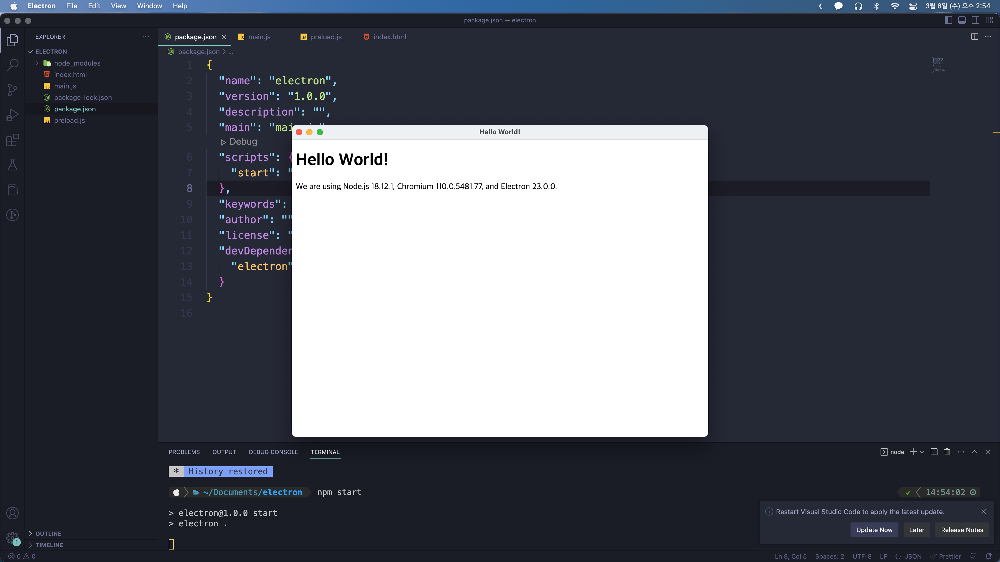

## Introduction

Electron은 HTML, CSS, Javascript로 Desktop app을 만들어주는 framework이다.
Chromuim과 Node.js가 내장되어있고, Javascript 코드 베이스로 Windows, macOS, Linux에 cross-platform app을 만들 수 있다.

나는 Electron을 들어는 보았지만 흥미가 생긴 것은 Steam의 Vampire Survivor가 Electron으로 만들었다는 사실을 알고난 이후부터이다. 군 복무 시절 HTML Canvas로 여러 게임을 만들어본 경험이 있기 때문에 그런 것들을 Desktop app으로 만들어보면 좋겠다는 생각을 했고, 그것들로 실습을 해볼 예정이다.

documentation의 기초 예제를 따라해보자.

```
npm install --save-dev electron
yarn add --dev electron
```

```js
// main.js

const { app, BrowserWindow } = require("electron");
const path = require("path");

function createWindow() {
  // 브라우저 윈도우 생성
  const win = new BrowserWindow({
    width: 800,
    height: 600,
    webPreferences: {
      preload: path.join(__dirname, "preload.js"),
    },
  });

  // HTML파일 로드
  win.loadFile("index.html");

  // 개발자 도구 열기
  // mainWindow.webContents.openDevTools()
}

// Electron이 완료되고 브라우저 창을 만들 준비가 끝난 뒤 동작 설정
app.whenReady().then(() => {
  createWindow();

  // 맥에서 아이콘을 누른 경우 창이 없으면 다시 창을 만든다.
  app.on("activate", () => {
    if (BrowserWindow.getAllWindows().length === 0) {
      createWindow();
    }
  });
});

// 맥을 제외한 OS에서 모든 창이 닫힌 경우 종료, 맥은 Cmd+Q를 눌러 종료하기 전까지 활성화시키는 것이 일반적이다.
app.on("window-all-closed", () => {
  if (process.platform !== "darwin") {
    app.quit();
  }
});
```

```js
// preload.js

// 모든 Node.js API를 preload에서 사용할 수 있다. 크롬 익스텐션과 같은 샌드박스를 가지고있다.
window.addEventListener("DOMContentLoaded", () => {
  const replaceText = (selector, text) => {
    const element = document.getElementById(selector);
    if (element) element.innerText = text;
  };

  for (const type of ["chrome", "node", "electron"]) {
    replaceText(`${type}-version`, process.versions[type]);
  }
});
```

```html
<!-- index.html -->

<!DOCTYPE html>
<html>
  <head>
    <meta charset="UTF-8" />
    <title>Hello World!</title>
    <meta
      http-equiv="Content-Security-Policy"
      content="script-src 'self' 'unsafe-inline';"
    />
  </head>
  <body>
    <h1>Hello World!</h1>
    <p>
      We are using Node.js <span id="node-version"></span>, Chromium
      <span id="chrome-version"></span>, and Electron
      <span id="electron-version"></span>.
    </p>
  </body>
</html>
```

package.json의 실행 script도 추가해준다.

```json
{
  "scripts": {
    "start": "electron ."
  }
}
```

잘 나오는 것을 볼 수 있다.


---

electron 파일을 배포하기 위해서는 electron-forge를 설치해야 한다. 다음과 같은 커멘드로 현재 운영체제에 맞는 프로그램을 생성할 수 있다.

```
npm install --save-dev @electron-forge/cli
npx electron-forge import

npm run make
```
