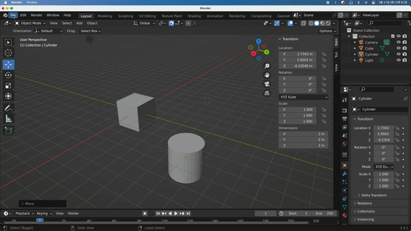

## Blender Hotkeys Error

Blender를 처음 사용할때 모든 backtick(\`), `Shift + A` 등 모든 단축키가 안먹히는 오류가 생기곤 한다. 맥의 문제인지 윈도우에서도 그런지는 모르겠으나, 단축키를 Override하는 방법으로 수정할 수 있다.

Edit - Preferences 에서 keymap 드롭다운을 Blender로 바꿔주면 된다.

[\[참고\]All hotkeys suddenly stopped working.](https://steamcommunity.com/app/365670/discussions/0/2273701484014465350/)
