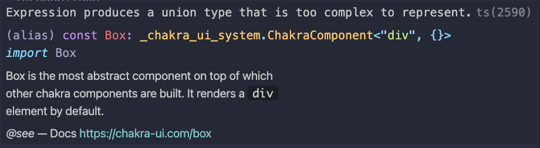

## Vscode: Expression produces a union type that is too complex to represent 에러

vscode를 업데이트한 뒤 chakra-ui의 컴포넌트에서 다음과 같은 에러가 발생했다.



```
Expression produces a union type that is too complex to represent. ts(2590)
```

다음과 같은 에러는 vscode를 업데이트하면서 타입스크립트의 버전이 `4.x`에서 `5.x`로 업데이트되었기 때문이다. 따라서 해결하려면 vscode가 아닌 프로젝트 node_modules에 있는 ts서버를 이용하면 된다.

---

### 해결방법 1

vscode 설정에서 `tsdk`를 검색한 뒤 `node_modules/typescript/lib`를 입력해준다.


---

### 해결방법 2

package.json에 tsdk 설정을 추가해준다.


이후 타입스크립트 파일을 열고 `F1`을 누른 뒤 `typescript`를 검색하고 `Select Typescript Version`옵션을 선택한다.


`Use Workspace Version`을 선택해 ts서버를 바꿔준다.
