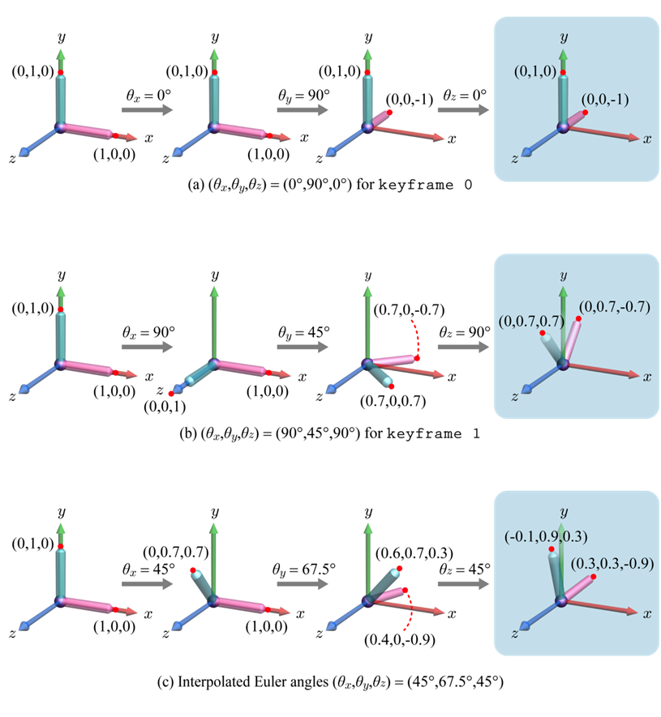
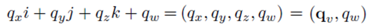
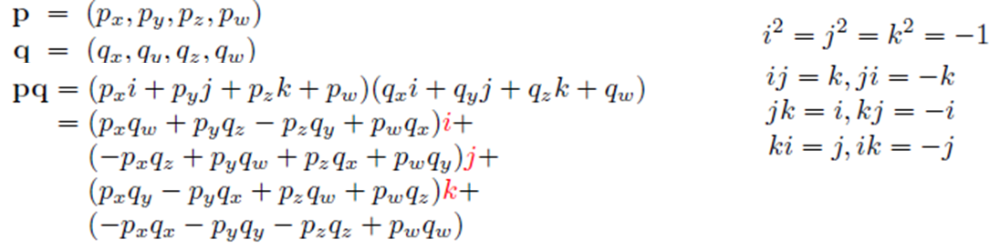
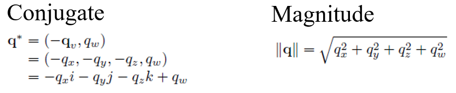
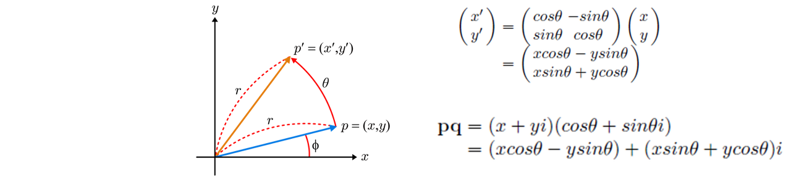
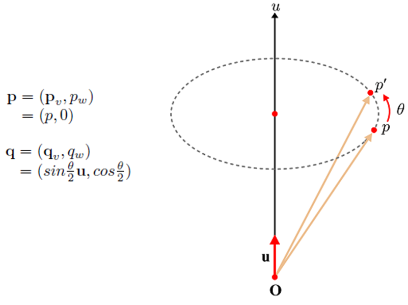
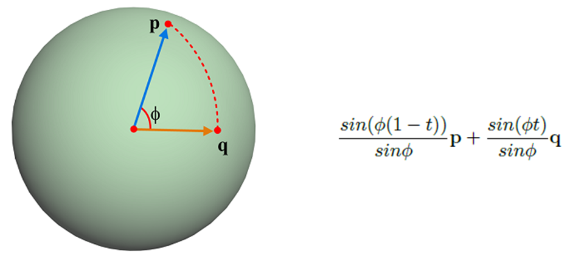
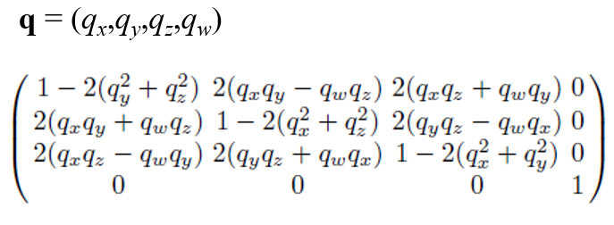

# Quaternion (사원수)

3D의 Transform 속성에는 네 가지가 있다.

- Position
- Rotation
- Scale
- Quaternion

이중 세가지는 상식적으로 이해할 수 있는데 `Quaternion`은 생소한 경우가 많다. 회전에는 `Euler(오일러)`와 `Quaternion(쿼터니언)`이 있는데 `Euler`가 일반적인 `Rotation`이고 이것을 보완해 나온 것이 `Quaternion`이다.

`Euler`는 X, Y, Z 축에 대한 회전을 표현하는 것이다. 하지만 단순히 각 축에 대하여 각도를 지정하는 것만으로는 회전이 고유하게 정해지지 않고 축에대한 회전의 순서에 따라 다르게 나타나기도 한다. `Euler`로 표현하는 것의 한계는 `짐벌락`현상과 `보간`을 예로 들 수 있다.

보간의 경우 위 그림에서 첫 번째와 두 번째 줄의 회전 변환 결과 사이를 보간한다고 가정했을 때, 첫 번째와 두 번째 줄의 회전 변환의 결과는 모두 yz-plane 평면상에 있으므로 보간한 결과들 역시 yz-plane 평면상에 있어야 할거 같다. 하지만 세 번째 줄의 결과를 보면 그렇지 않다. 이렇듯 Euler Angle를 사용하면 문제가 생길 수 있는 것이다.

짐벌락 현상의 경우 간단히 요약하자면, X, Y, Z축으로의 회전을 일정 순서로 진행하게 되면 두 축이 겹친 경우 다른 두 축의 회전이 동일해지기 때문에 한 축의 기능을 상실하게 된다는 내용이다.

`Quaternion`이란 4차원 벡터를 뜻하는 말로 4원수하고도 한다.
복소수를 이용해 이러한 문제를 해결했다는 선에서 이해하고 넘어갔다. [KUOCW 한정현 교수님 강의 자료](https://www.youtube.com/channel/UCfyXTCv0QlZxG1S1rteGI7A)를 첨부하겠다.

---

KUOCW 한정현 교수님 강의 자료

### Quaternion의 정의와 성질

하지만 Quaternion은 위의 문제를 해결할 수 있습니다. Quaternion이란 4차원 벡터를 뜻하는 말입니다. 한국말로는 4원수라고도 하죠. 여기서 복소수의 개념이 등장합니다. 아래와 같이 Quaternion을 정의하죠 왼쪽부터 3가지 항은 각각 다른 허수 축을 가지는 허수부로 오른쪽은 실수부를 나타냅니다. 세 가지 허수부를 줄여서 \_v로 나타내기도 하죠.

Quaternion

그리고 기본적인 두 Quaternion의 연산과 각 축에 대한 성질 은은 아래와 같습니다.

Quaternion 연산

또한 Quaternion의 켤례 복소수와 크기는 아래와 같이 표현되죠.

Quaternion의 켤례 복소수와 크기

### Quaternion을 이용한 회전

우선 복소수를 이용해 2D회전에 먼저 적용시켜 보겠습니다. 아래 그림과 같이 점 `p(x, y)`에서 점 `p'(x', y')`로 `θ`만큼 회전을 한다고 합시다. 이때 `p`를 복소수를 이용하여 `x+yi`로 나타내고 또 `θ`를 이용해 `cosθ+sinθi`로 하고 `pq`를 연산하면 실수부는 `x'`을 나타내고 허수부는 `y'`을 타나 내는 것을 확인할 수 있죠. 신기하게도 복소수를 이용해 회전에 관련된 값을 계산할 수 있는 것입니다.

복소수를 이용한 회전변환의 표현

그렇다면 3D에서는 어떻게 표현될까요? 3D에서는 한 가지 허수 축이 아니라 3가지 허수 축이 있는 Quaternion을 사용합니다. 아래와 같이 u라는 축을 기준으로 `θ`만큼 `p`에서 `p'`으로 회전을 한다고 가정해 봅시다. 그리고 `p`점의 `x, y, z` 좌표는 Quaternion의 허수부 `p_x, p_y, p_z`에 들어가고, 회전을 나타내는 Quaternion은 `θ`와 회전축 방향으로의 단위 벡터 `u`를 이용해 아래와 같이 `q`로 표현이 됩니다. 이때 위의 2D rotation을 복소수로 나타내면 그 값들을 찾을 수 있는 거 같이 3D에서는 이 Quaternion을 이용하여 `qpq*`연산을 하면 그 허수부가 회전한 `x', y', z'`을 나타낸다고 합니다(증명 생략).

Quaternion을 이용한 회전

이렇게 Quaternion을 이용하여 회전할 수 있게 되면, 굳이 문제가 생길 수 있는 Euler Angle을 이용하는 것이 아니라 임의의 축을 기준으로 회전시키면 되는 것이죠. 또한 앞서 문제가 되었던 회전 변환에 대한 보간도 Quaternion은 해결할 수 있습니다.

아래 그림과 같이 xyz 좌표를 아는 unit quaternion p 그리고 `q`를 가정했을 때, 그림 옆의 수식같이 보간이 가능합니다. 이때 ∅값은 두 quaternion의 내적을 통해 구할 수 있습니다. Unit quaternion이기 때문에 `||p||=||q||=1`이 되고 따라서 `||p||*||q||*cos∅ = cos∅`로 나타낼 수 있죠. 이때 각 좌표 성분 간의 곱을 합한 게 내적의 값이기도 하기 때문에 arccos을 통해 ∅를 충분히 구할 수 있죠. 따라서 아래 수식을 풀 수 있고, 보간이 가능한 것입니다. 이를 spherical linear interpolation (slerp)라고 부릅니다.

spherical linear interpolation(slerp)

마지막으로 Quaternion 역시 Euler angle과 같이 4x4 matrix에 들어가서 표현될 수 있습니다. 아래는 Quaternion을 통한 rotation matrix를 표현한 것입니다. 이때 `q`는 `(sin(θ/2)u, cos(θ/2))`일 거 같습니다. 증명은 강의에서도 다루지 않아 저도 넘어가겠습니다. 이로써 Euler angle의 역할을 Quaternion이 다 해낼 수 있는 것이죠.

