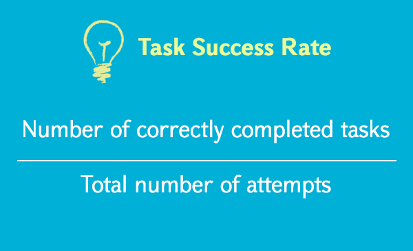
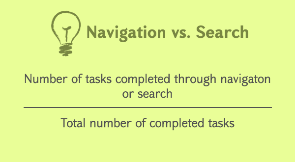
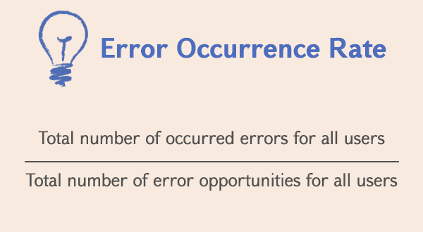
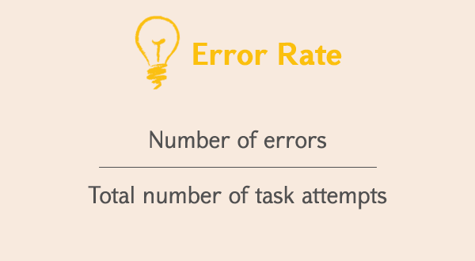

# UX KPI

서비스를 만들고 나면 모든 기획자가 자신이 기획한 서비스에 대해 사용자 측면에서 효과를 정량적으로 검증하고 싶어할 것이다.

'수치로 내서 측정하는 것'을 통해 모든 것을 이해하는 건 어렵지만 어느 상황을 간단히 이해하여 평가하는 것은 가능하다.
그럼 UX를 수치로 나타내 계산하는 것은 가능한 일일까?

답은 '그렇다'이다. 현재 'UX'이라하면 사용자 인터랙션을 향상시키거나 사용자의 만족도를 높이자와 같은 정성적인 목표를 설정하기 쉽상이다. 그러나 정말로 그러한 목표를 달성하였는지를 정량적으로 계측하며 진행시키는 것이 필요하다. UX KPI는 이거들을 정량적으로 측정하는 방법이다.

### KPI란 무엇인가?

KPI(중요업적평가지표)의 의미는 '목표 달성정도를 계산하는 정향적 지표'를 나타낸다. 이들 지표는 어느 조직, 사업 목표에 대해 얼마나 달성하였는가를 측정하는 중요한 역할을 지닌다. 이러한 이유에서 UX에 관한 목표설정을 설정했으면, 해당 목표와 현재 지점을 측정하는 지표를 'UX KPI'라 표기하고자 한다.

### 중요한 UX KPI에 대해서

UX에 관한 지표 측정방법은 판매나 마케팅, 재무들에서 사용되어온 지표와는 조금 다르다. 왜냐하면 UX에 관한 지표는 인간의 행동과 심리를 반영하고 있기 때문이다. 이러한 류의 정보는 미래수치로 바꾸기에 상당히 어렵다. 그러나 한편으로 UX KPI는 사물의 본질을 파악하여 커다란 유저빌리티 문제를 숫자로 측정할 수 있다. 또한, 시계열로 변화를 간단히 따라가 볼 수 있다.
기본적으로 UX디자인 팀은 '정량적인 수치'와 '정성적 수치'라는 큰 2가지 UX KPI를 사용할 수 있는 것이다.

### 정량적인 UX KPI

1. Task Success rate (유저의 태스크 성공률(CVR))
2. Time on Task (유저가 어느 목적을 달성할 때 걸린 시간)
3. User of search vs. navigation (검색 또는 내비게이션 이용률)
4. User error rate (이탈률)
5. System Usability Scale (SUS: 시스템 유저빌리티 스케일)

### 정성적인 UX KPI

1. 유저의 기대치
2. 종합적 만족도

### 1. Task Success Rate (유저의 태스크 성공률)

Task Success Rate란 전체 사용자 중 어느 정도 비율의 사용자가 태스크를 성공하였는가?하는 '사용자의 태스크 성골률'을 말한다.
이는 지금 가장 자줒 사용되는 지표이자, 어느 정도 좋은 효율로 사용자가 태스크를 달성했는지를 아는 지표이다. 사용자등록과 상푸구입들과 같이 명확히 사용자의 골(태스크)이 정의되어 있다면, Task Success Rate을 측정할 수 있다. 이 때문에 데이터를 마구 모으기 전에 유저의 태스크, 골이 무엇인지를 정확하고 명확히 정의할 필요가 있다.

Task Success Rate = 태스크를 달성한 유저 / 시도한 모든 유저

이 지표는 어째서 사용자가 태스크를 달성하지 못했는지까지는 모르더라도 매우 편리한 수치가 된다. 또한, 초회 유저의 Task Succes Rate를 측정하여, 그 사용자가 서비스를 계속 사용하는 동한 어떻게 rate가 변화하는지를 추적해나가는 것도 매우 중요하다. 이는 당신 서비스의 '학습하기 쉬움'을 나타내는 지표이자, 'UX'를 측정할 수 있는 매우 중요한 수치가 된다. Task Success Rate는 높을 수록 좋다.

### 4. Time on Task (태스크를 당성하기까지의 소요시간)

Time on Task는 태스크를 당성하기까지 유저가 소비한 시간을 가리키며, 통상적으로는 분이나 초와 같은 단위로 표시한다. 이 Time on Task는 다양한 방법으로 토출되는데, 통상적으로 각 태스크에 유저가 소비한 시간 평균치를 측정하면 좋다.

Time on Task는 문제를 특정짓는데 매우 도움되는 지표다. 그리고 다른 이터레이슨(반복)에 따른 지표와 비교함에 따라 보다 깊은 통찰을 가져온다.

### 3. Use of Search vs. Navigation (검색 VS 내비게이션)

이는 정보구조나 내비게이션 효과를 측정함에 있어 매우 효과적인 측정방법이다. 혹시 유저가 무언가를 사이트 내에서 내비게이션을 통해 찾아나가고, 발견하지 목했다면 검색이 마지막 수단이 된다.

다음 식으로 수치를 낼 수 있다.

Navigation vs. Search = 내비게이션 or 검색을 통한 태스크 달성 수 / 전체 태스크 달성 수

### 4. User Error Rate (사용자 실패율)

일반적으로는 에러는 사용자경험을 평가함에 있어 가장 유효한 지표이다.
에러란 몇 번 에러가 있었는지, 어디서 일어났는지? 어느 디자인의 프로덕트이며 어떠한 타입의 에러가 일어났는지? 등 정말로 자신의 프로덕트가 사용하기 쉬운 것인지를 알려준다. 에러와 '유저빌리티'한, 거의 같은 의미로 사용되는 일도 있을 정도로 관련성이 깊다.

에러 레이트는 몇가지 방법으로 측정이 가능하다.

(1) 어느 태스크를 달성하기 위해 사용자가 실패하기 쉬운 에러 기회가 일부 or 복수인지, 하나만을 측정하고 싶을 때 (ex. 입력폼 중 패스워드 필드만), 하기 계산식대로 수치를 내면 좋다.

Error Occurence Rate = 모든 유저의 총 에러 수 / 모든 유저릐 에러가 일어나는 기회의 수

(2) 한가지 태스크를 당성하는 것에 대해 몇가지 에러가 날 수 있는 경우 or 모든 유저 에러평균치를 내고 싶을 때, 다음과 같은 계산식이 된다.

Error Rate = 에러 수 / 태스크를 시도한 합계

예) 5명의 유저가 온라인상으로 신용카드를 결제하였다. 이 태스크엔 7가지 에러발생기회가 있다. 각각 유저는 2, 4, 1, 2, 3회 각각 에러를 발생시켰다. 이 경우 에러 발생률 평균은 다음과 같다.

(2+4+1+2+3) / 7 X 5 = 0.34 X 100 = 34%

### 5. System Usability Scale (SUS: 시스템 유저빌리티 스케일)

시스템 유저빌리티 스케일이란 아마 지금 가장 넓게 사용되고 있는 유저빌리티 측정방법 중 하나일 것이다. 이 KPI는 유저에게 보내는 설문조사를 기본으로 하며, 프로덕트 수치를 측정하는 것만으로는 낼 수 가 없다. 사용자 협력이 필요하다. 이 SUS는 사용자가 프로덕트를 사용했을 때 얻는 만족도 등 정성적인 데이터를 측정하는데 효과적이다.

### Qualitative KPIs (정성적인 KPI)

정성적인 정보는, 일반적으로 모으기가 매우 어렵다. 그렇기 때문에 매우 가치있으며 보다 많은 고찰점을 얻을 수 있다. 정성적인 KPI를 모으는데는 실제 유저에 대한 유저빌리티 테스트와 앙케이트 등 직접적인 커뮤니케이션이 필요하다.

이것들을 매우 시간이 걸리며, 서비스 수치를 측정하는 것보다 더 많은 노력을 필요로 한다. 하지만 조직에 있어 가치있는 정보를 얻을 수 있다. 혹, 유저 인터뷰를 실시한다면 특히 유저가 프로덕트를 사용하기 전 갖고있던 '기대감'과 실제 사용해보고나서 느끼는 '그 기대치와 비교해 어떠했는가'에 집중하여 물으면 좋다.

SUS들의 방법론 또한, 이들 정성적인 정보를 얻기 위해 유효하다.

### Final Thoughts (글을 끝맺으며)

UX KPI란 프로적트에 관련된 모든 사람들에게 있어, UX와 데이터분석에 익숙치 않더라도 UX에 관한 개선 진척을 간단히 이해할 수 있는 좋은 방법이다. 여기서 소개한 UX에 관한 지표에 있어, 개선한 결과를 측정하고 유저빌리티 변화 ROI를 측정할 수 있다. 각각 프로덕트에 따라 다양한 지표를 측정하고 새롭게 정의내린 UX KPI를 사용하게 될지도 모르겠다. 단, UX KPI는 측정이 가능하고 사요하기 쉬운 한 계속해서 도움이 될 것이다.

`[참고]https://designmodo.com/ux-kpi/`