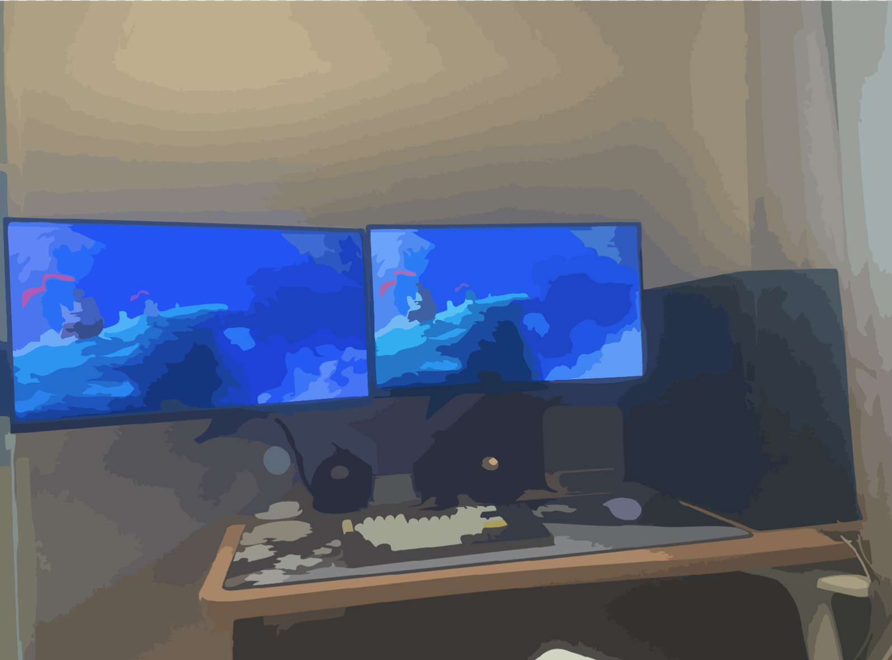

# Frontend Recolor

### 프론트엔드 위주 관련 개발 및 공부한 내용 등 여러가지 내용들을 기록하는 블로그 입니다.

  

- [ES6](https://rheeeuro.github.io/es6/)
- [Electron](https://rheeeuro.github.io/electron/)
- [Three.js](https://rheeeuro.github.io/three.js/)
- [Webpack](https://rheeeuro.github.io/webpack/)
- [Interactive](https://rheeeuro.github.io/interactive/)
- [Blender](https://rheeeuro.github.io/blender/)
- [Errors](https://rheeeuro.github.io/errors/)
- [Core JS](https://rheeeuro.github.io/corejs/)
- [Etc](https://rheeeuro.github.io/etc/)

[GitHub Source][github repo]{: .btn .btn-primary .fs-5 .mb-4 .mb-md-0 .mr-2 }

---

[github repo]: https://github.com/rheeeuro/rheeeuro.github.io
