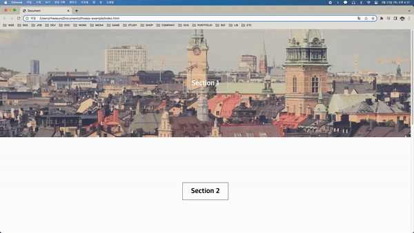
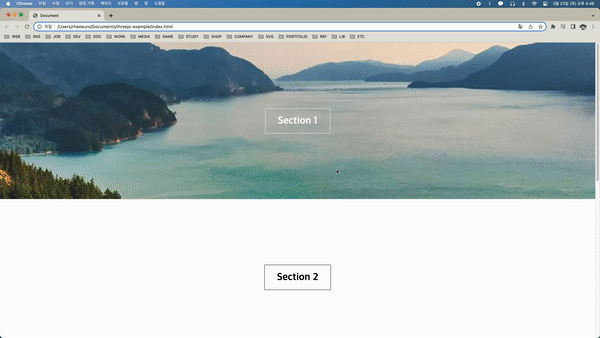

## Simple Parallax Background

[[출처] Parallax Background With Only One CSS Property](https://youtu.be/h92U3eRMvw0)

일단 HTML 섹션 네개를 만들어 준다.

```html
<section>
  <h1>Section 1</h1>
</section>
<section>
  <h1>Section 2</h1>
</section>
<section>
  <h1>Section 3</h1>
</section>
<section>
  <h1>Section 4</h1>
</section>
```

그리고 기본적인 css를 작성해준다.

```css
* {
  padding: 0;
  margin: 0;
}

section {
  width: 100%;
  height: 500px;
  display: flex;
  flex-direction: column;
  align-items: center;
  justify-content: center;
  background-size: cover;
  background-position: center;
}

section:first-child {
  background-image: url("https://picsum.photos/2000");
}

section:nth-child(3) {
  background-image: url("https://picsum.photos/1700");
}

h1 {
  border: solid 1px black;
  padding: 20px 40px;
  font-size: 2rem;
}

section:first-child h1,
section:nth-child(3) h1 {
  color: white;
  border-color: white;
}
```

다음과 같이 네 개의 섹션과 1, 3번째 섹션에 배경 이미지가 만들어진 것을 볼 수 있다.



여기서 section에 background-attatchment를 fixed로 설정만 해주어도 간단하게 효과를 만들 수 있다.

```css
section {
  ...
  background-attachment: fixed;
}
```


