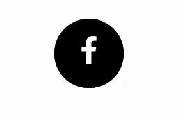

## Liquid Effects on Buttons

[[출처] CSS Button Animation Tutorial - Liquid / Goo / Sticky Effect With SVG Filters](https://youtu.be/eExhAt8luvU)



### 적용 원리 설명

HTML 구조

```html
<div class="button">
  <i class="fab fa-facebook-f"></i>
  <div class="blurred">
    <span></span>
    <span></span>
  </div>
</div>
```

- `.button`은 투명, `.blurred > span` 두개가 검은 배경의 원이다.

- `.blurred` div에 가상요소 `::before`와 `::after`를 만든 후 `.button`이 hover 시에 transition을 걸어준다.

- `.button` hover시에 span 두 개를 위아래로 이동시키고 크기를 조절해준다.

- 가상요소들은 hover시 중앙과 우측으로 position을 지정해준다. 크기가 지정이 되어 있지 않다가 hover시에만 크기가 생기므로 transition이 적용되지 않는 것 같다.

- `.blurred`에 필터를 적용한다.

```html
<svg>
  <defs>
    <filter id="goo">
      <feGaussianBlur in="SourceGraphic" stdDeviation="10" result="name" />
      <feColorMatrix
        in="name"
        mode="matrix"
        values="1 0 0 0 0
                  0 1 0 0 0
                  0 0 1 0 0
                  0 0 0 30 -15 "
        result="aab"
      />
      <feBlend in="SourceGraphic" in2="aab" />
    </filter>
  </defs>
</svg>
```
