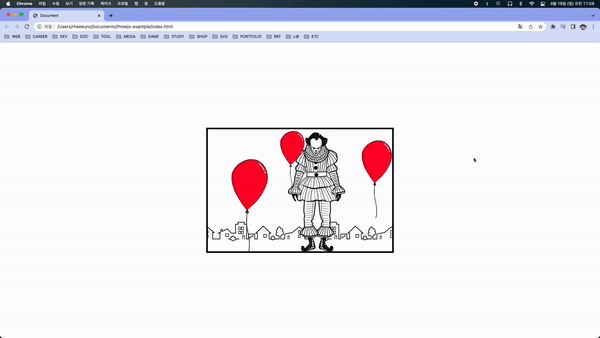

## CSS Parallax

[[출처] CSS Parallax Tutorial for Beginners Animated CSS3 Card Hover Effects](https://youtu.be/Hx2R1GbVwr0)



HTML구조

```html
<div class="wrapper">
  <div class="frame">
    
  </div>
  
  
  
</div>
```

### 적용 원리 설명

- wrapper의 크기를 지정한 뒤 position을 absolute로 변경해준다. 그 후 perspective를 2000px 준다. (translateZ 변화를 활성화)

- frame에 배경 이미지와 테두리를 주고 적절한 `background-position`을 준다. overflow를 hidden으로 바꿔준다.

- clown과 balloon들의 위치를 잡아준다.

- wapper hover시 frame의 `background-position`을 변경해주고 적절하게 rotateY, rotateZ, translateZ 값을 변경해준다. 그림자도 크게 만들어준다.

- wrapper hover시 balloon들의 translate과 scale을 적절하게 변경해준다.
