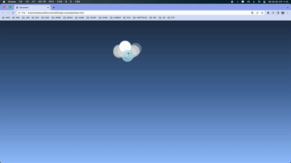

## Aminated Clouds Effect

[[출처] HTML Canvas & Vanilla JavaScript Animation Series 2 - Animated Clouds Effect](https://youtu.be/hF-QBhDG-wE)

### 적용 원리 설명

- (x, y)좌표, (x, y)속도, 크기, 색을 속성으로 가지고있는 Particle 클래스를 만든다.

- mousemove 이벤트리스너를 등록해 마우스 좌표를 업데이트해 변수에 담아둔다.

- (x, y) 좌표에 `this.color`를 색으로 갖는 원을 그리는 draw 메서드를 만든다.

- update 메서드를 만들어준다. 벽에 부딫힐경우 속도를 -속도로 바꾸어주고 마우스 주변의 Particle은 크기를 키워준다. 이후 전체 Particle의 크기를 미세하게 줄여준다. (size가 음수가 될 경우 0으로 고정)

- init 함수에서 랜덤 좌표, 랜덤 속도, 랜덤 색상을 같는 Particle을 1000개 만들고 requestAnimationFrame 에 등록된 함수에서 Particle별로 update함수와 draw함수를 실행해준다.
