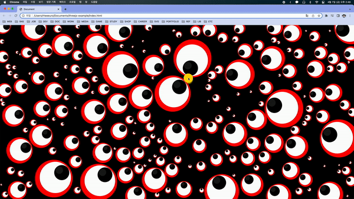

## Animated Eyeballs

[[출처] Animated JavaScript Eyeballs](https://youtu.be/52rKp7P3gIs)

### 적용 원리 설명

- mousemove 이벤트리스너를 등록해 마우스 좌표를 업데이트해 변수에 담아둔다.

- x, y, radius 속성을 갖는 Eye 클래스를 만들어준다.

- draw 메서드를 만들어준다. (x, y)좌표에 radius 반지름을 갖는 원을 그려준 뒤 마우스 좌표와 (x, y) 좌표 사이의 각도를 구해준다. (`Math.atan2(dy, dx)`이용) cos theta, sin theta에 this.radius를 곱한 뒤 적정 배율을 곱한 뒤, (x, y) 좌표를 더해 그 위치에 원을 그려준다. (흰자) 한번더 검은 눈동자를 그려준다. (눈동자에 비치 원을 하나 더 그려준다.)

- init 함수에서 일정 숫자의 눈을 추가해주는에 overlapping 함수와 counter를 추가해, 반복문을 돌 때마다 이전 눈들과 거리를 비교해 일정거리 이상일 경우만 추가해주고 counter를 증가시켜준다.

- requestAnimationFrame 에 등록된 함수에서 Particle별로 draw함수를 실행해준다.
