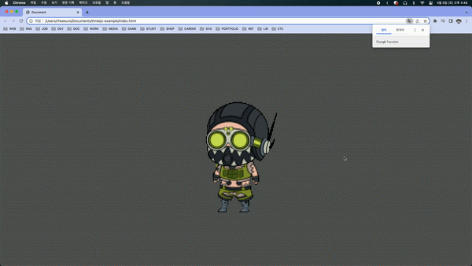

## Image into Interactive Particles

[[출처] Image into Interactive Particles - HTML Canvas Animation Tutorial](https://youtu.be/afdHgwn1XCY)

### 적용 원리 설명

- mousemove 이벤트리스너를 등록해 마우스 좌표를 업데이트해 변수에 담아둔다.

- image 객체에 src속성으로 base64 이미지를 넣어준다. (온라인 컨버터로 png를 base64로 변환한다.)

- x, y, color, size 속성을 갖는 Particle 클래스를 만들어준다. baseX, baseY (원래 이미지에서 particle의 위치)와 랜덤 density값 속성을 추가해준다.

- (x, y) 좌표에 size의 반지름을 갖는 `this.color` 색의 원을 그리는 draw 메서드를 만들어준다.

- `ctx.getImageData` 메서드를 이용해 particle별로 `ctx.fillStyle`을 바꿔준다. (pixel별 rgba값이 숫자로 들어가있다. width X height X 4 개의 array)

- update 메서드를 만들어준다. 마우스와 현재 거리를 비교해 `(최대거리 - 거리) / 최대거리`를 force 변수로 만들어준다. (음수일 경우 force는 0으로 고정시킨다.)

- `(x방향 이동거리 / 이동거리) * force * this.density * 0.6`으로 x 방향 이동해야 할 거리를 계산한다. 거리가 일정거리 이하면 이동해야 할 거리만큼 이동시키고, 이상일 경우 (x, y)좌표가 (baseX, baseY) 좌표가 아닐 때 이동거리 / 20 만큼 이동시킨다.

- init 함수에서 image data의 width, height의 이중 반복문을 돌며, x, y, color를 갖는 Particle을 만들어준다.

- requestAnimationFrame 에 등록된 함수에서 Particle별로 update 및 draw함수를 실행해준다.

- png가 로드되었을 때 `eventListener`로 전체 코드를 담는 함수를 실행시켜준다.
