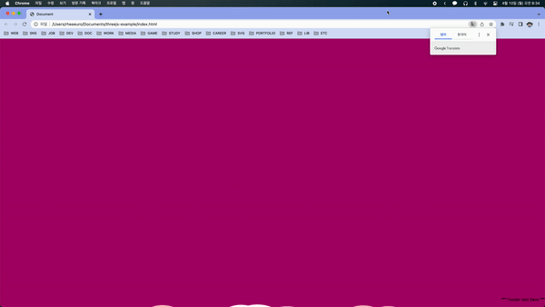

## Sticky Bubbles

[[출처] Sticky Bubbles Vanilla JavaScript Animation Tutorial](https://youtu.be/5575fjFzPT0)

### 적용 원리 설명

- 두 개의 canvas(canvas, canvasBg)를 만든다.

- Bubble 클래스를 만든다. Bubble은 radius(반지름), life, x, y, vy(y속도), vr(반지름이 줄어드는 속도), vx(x속도), color의 인자를 갖는다.

- update 메서드를 만들어준다. vr과 vy를 증가시켜주고 (x, y) 좌표를 vx, vy만큼 이동시켜준다. radius가 1보다 큰 경우 vr만큼 줄이고, 1미만인 경우 life를 false로 만들어준다.

- draw 메서드를 만들어준다. (x, y) 좌표에 radius 반지름을 갖는 color 색의 원을 그린다.

- handleBubble 함수를 만들어준다. 일정 갯수가 되도록 canvas에 bubbles, canvasBg에 BgBubbles를 만들어주고 모든 bubble을 업데이트해준다. bubble의 life가 false인 경우 array.splice 메서드를 통해 없애준다.

- requestAnimationFrame 에 등록된 animate 함수에서 handleBubble을 실행해주고 bubble별로 draw메서드를 실행해준다.

- canvas에 GaussianBlue svg 필터를 걸어준다.
