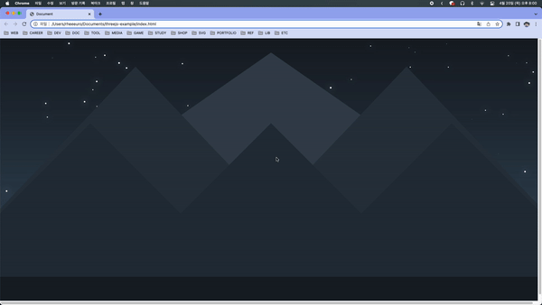

## Star Shower

[[출처] How to Code: Star Shower](https://youtu.be/lNz8LOk438U)

### 적용 원리 설명

- x, y, radius, color값을 갖는 Star 오브젝트를 만든다. draw 메서드로 원을 그리고 update 메서드로 x속도, y속도를 x, y좌표에 더해주고 벽에 닿는 경우 속도를 반대 \* 0.8(마찰)로 바꿔준다. y 속도를 중력효과로 점점 올려준다.

- MiniStar 오브젝트를 만든다. Star과 거의 같은 값과 메서드를 가진다. Star 오브젝트에 shatter 메서드를 만들어주고 벽에 닿는 경우 shatter 메서드를 호출한다. shatter 메서드에서는 star의 x, y좌표에 랜덤 속도를 갖는 miniStar를 8개 만들어준다.

- miniStar는 opacity를 점점 줄이다가 0이 되는 경우 제거해주고, Star는 벽에 닿을 때마다 크기가 작아지고 크기가 0이 되는 경우 제거해준다.

- 뒷 배경을 그려주고 Star과 miniStar 오브젝트의 draw 메서드에 `context.shadowColor`과 `context.shadowBlur` 값을 조절해 블러 효과를 넣어준다.
