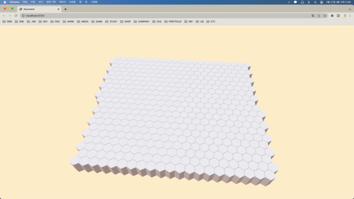
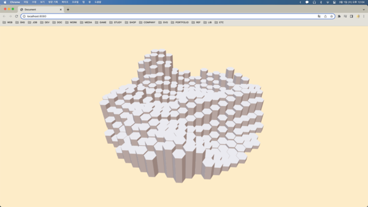
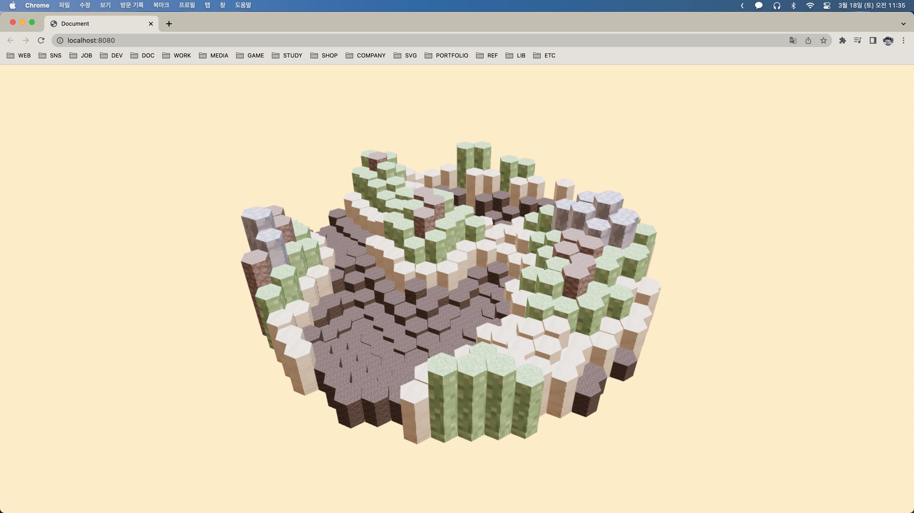
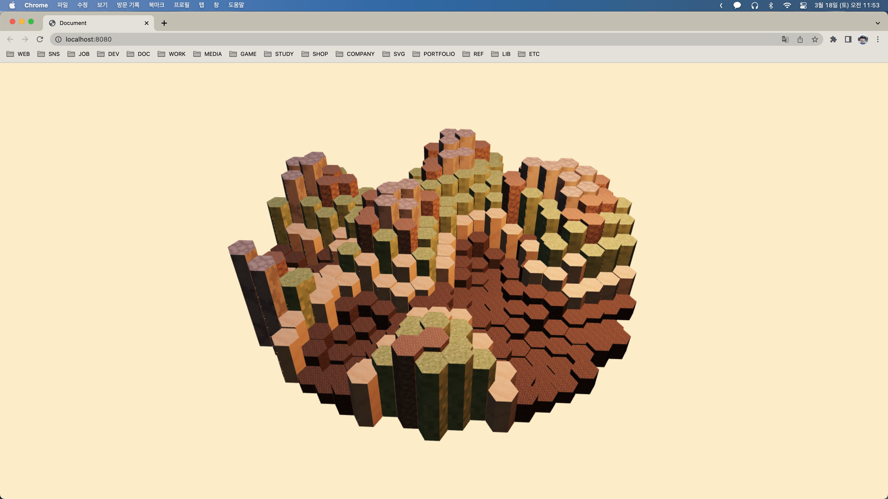
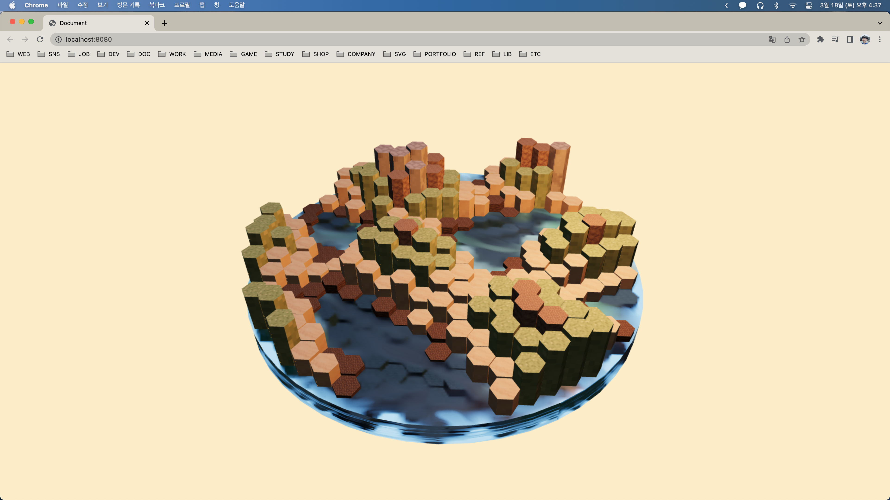
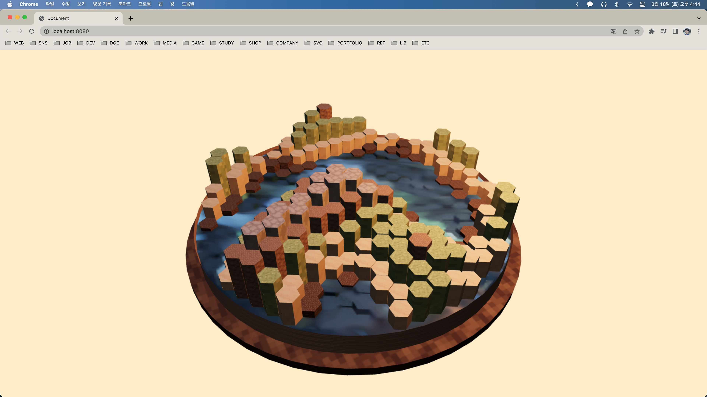
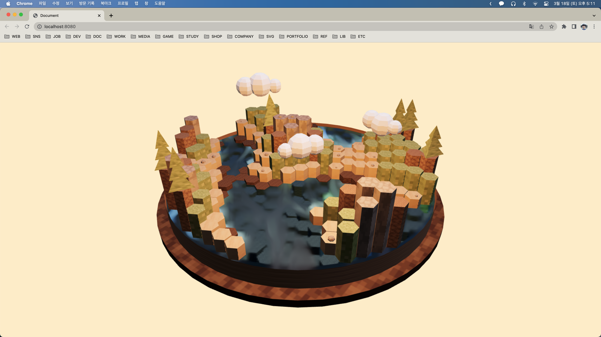

## Procedural Map

출처: [Three.js in practice - Procedural Map - tutorial for beginners 2022](https://youtu.be/HsCYEA_UuZA)

먼저 three.js 기본 Scene 설정을 해준다.

```js
const scene = new Scene();
scene.background = new Color("#FFEECC");

const camera = new PerspectiveCamera(45, innerWidth / innerHeight, 0.1, 1000);
camera.position.set(-17, 31, 33);

const renderer = new WebGLRenderer({ antialias: true });
renderer.setSize(innerWidth, innerHeight);
renderer.toneMapping = ACESFilmicToneMapping;
renderer.outputEncoding = sRGBEncoding;
renderer.physicallyCorrectLights = true;
// physicallyCorrectLights 설정을 통해 빛을 물리적으로 사실적이게 만들어준다.
document.body.appendChild(renderer.domElement);

(async function () {
  renderer.setAnimationLoop(() => {
    renderer.render(scene, camera);
  });
})();
```

그 후 OrbitControls를 추가해준다.

```js
const controls = new OrbitControls(camera, renderer.domElement);
controls.target.set(0, 0, 0);
// 컨트롤을 약하게 하기 위한 설정
controls.dampingFactor = 0.05;
controls.enableDamping = true;

// in AnimationLoop function
controls.update();
```

그 후 hexagon을 만드는 함수들을 선언해준다.

```js
// hexagon을 한개씩 그리면 성능이 저하되므로 하나의 hexagonGeometries에 계속 merge시켜 나간다.
let hexagonGeometries = new BoxGeometry(0, 0, 0);

function hexGeometry(height, position) {
  let geo = new CylinderGeometry(1, 1, height, 6, 1, false);
  geo.translate(position.x, height * 0.5, position.y);

  return geo;
}

function makeHex(height, position) {
  let geo = hexGeometry(height, position);
  hexagonGeometries = mergeBufferGeometries([hexagonGeometries, geo]);
}

// 타일간에 간격을 만들어주는 함수
function tileToPosition(tileX, tileY) {
  return new Vector2((tileX + (tileY % 2) * 0.5) * 1.77, tileY * 1.535);
}
```

Scene에 hexagon을 추가해준다.

```js
// in init function
let pmrem = new PMREMGenerator(renderer);
let envmapTexture = await new RGBELoader()
  .setDataType(FloatType)
  .loadAsync("assets/envmap.hdr");
envmap = pmrem.fromEquirectangular(envmapTexture).texture;

for (let i = -10; i <= 10; i++) {
  for (let j = -10; j <= 10; j++) {
    makeHex(3, tileToPosition(i, j));
  }
}
let hexagonMesh = new Mesh(
  hexagonGeometries,
  new MeshStandardMaterial({ envMap: envmap, flatShading: true })
);
scene.add(hexagonMesh);
```

다음과 같이 hexagon 타일이 만들어진 것을 확인할 수 있다.



---

hexagon 타일을 원형으로 만들어주기 위해 position이 일정 거리 이상이면 생성하지 않도록 만들어준다.

```js
for (let i = -10; i <= 10; i++) {
  for (let j = -10; j <= 10; j++) {
    let position = tileToPosition(i, j);

    if (position.length() > 16) continue;

    makeHex(3, tileToPosition(i, j));
  }
}
```

이후 랜덤한 노이즈를 주기 위해 simplex-noise 모듈을 설치한다.

```js
const MAX_HEIGHT = 10;

// in init function
const simplex = new SimplexNoise();

// modify loop
for (let i = -10; i <= 10; i++) {
  for (let j = -10; j <= 10; j++) {
    let position = tileToPosition(i, j);

    if (position.length() > 16) continue;

    let noise = (simplex.noise2D(i * 0.1, j * 0.1) + 1) * 0.5;
    noise = Math.pow(noise, 1.5);

    makeHex(noise * MAX_HEIGHT, tileToPosition(i, j));
  }
}
```

다음과 같이 원형이면서 랜덤한 높이의 hexagon 타일이 완성되었다.



---

이후 texture 이미지를 assets 폴더에 추가시켜준 뒤 높이도 지정해준다.

```js
const MAX_HEIGHT = 10;
const STONE_HEIGHT = MAX_HEIGHT * 0.8;
const DIRT_HEIGHT = MAX_HEIGHT * 0.7;
const GRASS_HEIGHT = MAX_HEIGHT * 0.5;
const SAND_HEIGHT = MAX_HEIGHT * 0.3;
const DIRT2_HEIGHT = MAX_HEIGHT * 0;

// in init function
let textures = {
  dirt: await new TextureLoader().loadAsync("assets/dirt.png"),
  dirt2: await new TextureLoader().loadAsync("assets/dirt2.jpg"),
  grass: await new TextureLoader().loadAsync("assets/grass.jpg"),
  sand: await new TextureLoader().loadAsync("assets/sand.jpg"),
  water: await new TextureLoader().loadAsync("assets/water.jpg"),
  stone: await new TextureLoader().loadAsync("assets/stone.png"),
};
```

그리고 하나의 Geometry로 통채로 생성하는 대신 지형별로 Boxgeometry 변수를 나누어준다.

```js
// let hexagonGeometries = new BoxGeometry(0, 0, 0);
let stoneGeo = new BoxGeometry(0, 0, 0);
let dirtGeo = new BoxGeometry(0, 0, 0);
let dirt2Geo = new BoxGeometry(0, 0, 0);
let sandGeo = new BoxGeometry(0, 0, 0);
let grassGeo = new BoxGeometry(0, 0, 0);
```

그리고 설정한 높이에 따라 다른 geometey에 merge되도록 makeHex함수를 수정해준다.

```js
function makeHex(height, position) {
  let geo = hexGeometry(height, position);

  if (height > STONE_HEIGHT) {
    stoneGeo = mergeBufferGeometries([geo, stoneGeo]);
  } else if (height > DIRT_HEIGHT) {
    dirtGeo = mergeBufferGeometries([geo, dirtGeo]);
  } else if (height > GRASS_HEIGHT) {
    grassGeo = mergeBufferGeometries([geo, grassGeo]);
  } else if (height > SAND_HEIGHT) {
    sandGeo = mergeBufferGeometries([geo, sandGeo]);
  } else if (height > DIRT2_HEIGHT) {
    dirt2Geo = mergeBufferGeometries([geo, dirt2Geo]);
  }
}
```

hexMesh 함수를 만들어준다.

```js
function hexMesh(geo, map) {
  let mat = new MeshPhysicalMaterial({
    envMap: envMap,
    envMapIntensity: 1,
    // envMapIntensity: 0.135,
    flatShading: true,
    map,
  });

  let mesh = new Mesh(get, mat);

  return mesh;
}
```

그 후 init 함수 기존의 hexagonMesh를 지형별 Mesh로 바꿔준다.

```js
let stoneMesh = hexMesh(stoneGeo, textures.stone);
let grassMesh = hexMesh(grassGeo, textures.grass);
let dirt2Mesh = hexMesh(dirt2Geo, textures.dirt2);
let dirtMesh = hexMesh(dirtGeo, textures.dirt);
let sandMesh = hexMesh(sandGeo, textures.sand);
scene.add(stoneMesh, dirtMesh, dirt2Mesh, sandMesh, grassMesh);
```

다음과 같이 texture가 입혀진 것을 확인할 수 있다.



다음은 Scene의 광원을 설정할 차례이다. 일단 까먹기 쉬우니 renderer에 shadowMap 설정을 추가해준다.

```js
renderer.shadowMap.type = PCFShadowMap;
```

그 다음 Scene에 Light를 추가해준다.

```js
const light = new PointLight(
  new Color("#FFCB8E").convertSRGBToLinear().convertSRGBToLinear(),
  80,
  200
);
light.position.set(10, 20, 10);

light.castShadow = true;
light.shadow.mapSize.width = 512;
light.shadow.mapSize.height = 512;
light.shadow.camera.near = 0.5;
light.shadow.camera.far = 500;
scene.add(light);
```

그리고 그림자 설정을 hexMesh 함수에 추가해준다.

```js
function hexMesh(geo, map) {
  let mat = new MeshPhysicalMaterial({
    envMap: envmap,
    envMapIntensity: 0.135,
    flatShading: true,
    map,
  });

  let mesh = new Mesh(geo, mat);
  mesh.castShadow = true;
  mesh.receiveShadow = true;

  return mesh;
}
```

그림자가 적용된 것을 확인할 수 있다.


---

그 다음은 물을 만들어 줄 차례이다. 물 Mesh를 만들어준다.

```js
// in init function
let seaMesh = new Mesh(
  new CylinderGeometry(17, 17, MAX_HEIGHT * 0.2, 50),
  new MeshPhysicalMaterial({
    envMap: envmap,
    color: new Color("#55aaff").convertSRGBToLinear().multiplyScalar(3),
    ior: 1.4,
    transmission: 1,
    transparent: true,
    thickness: 1.5,
    envMapIntensity: 0.2,
    roughness: 1,
    metalness: 0.025,
    roughnessMap: textures.water,
    metalnessMap: textures.water,
  })
);
seaMesh.receiveShadow = true;
seaMesh.position.set(0, MAX_HEIGHT * 0.1, 0);
scene.add(seaMesh);
```

물이 생긴 것을 확인할 수 있다.


Cylinder의 사이드 부분이 이상하니 살짝 더 큰 Cylinder로 덮어주도록 하자.

```js
// in init function

let mapContainer = new Mesh(
  new CylinderGeometry(17.1, 17.1, MAX_HEIGHT * 0.25, 50, 1, true),
  new MeshPhysicalMaterial({
    envMap: envmap,
    map: textures.dirt,
    envMapIntensity: 0.2,
    side: DoubleSide,
    // 더블 사이드를 설정 안해주면 안쪽이 채워지지 않게 된다.
  })
);
mapContainer.receiveShadow = true;
mapContainer.position.set(0, MAX_HEIGHT * 0.125, 0);
scene.add(mapContainer);
```

마지막으로 바닥 밑부분을 만들어준다.

```js
let mapFloor = new Mesh(
  new CylinderGeometry(18.5, 18.5, MAX_HEIGHT * 0.1, 50),
  new MeshPhysicalMaterial({
    envMap: envmap,
    map: textures.dirt2,
    envMapIntensity: 0.1,
    side: DoubleSide,
  })
);
mapFloor.receiveShadow = true;
mapFloor.position.set(0, -MAX_HEIGHT * 0.05, 0);
scene.add(mapFloor);
```

바닥이 생긴 것을 확인할 수 있다.


---

마지막으로 바닥에 돌과 나무를 배치해 볼 차례이다. 먼저 돌을 생성하는 함수를 만들어준다.

```js
function stone(height, position) {
  const px = Math.random() * 0.4;
  const pz = Math.random() * 0.4;

  const geo = new SphereGeometry(Math.random() * 0.3 + 0.1, 7, 7);
  geo.translate(position.x + px, height, position.y + pz);

  return geo;
}
```

이후 Geometry가 stone이나 sand인 경우 일정 확률로 돌이 생성되게 로직을 만들어준다. (sand인 경우에도 stoneGeo에 merge해 주어야 한다.)

```js
function makeHex(height, position) {
  let geo = hexGeometry(height, position);
  // hexagonGeometries = mergeBufferGeometries([hexagonGeometries, geo]);

  if (height > STONE_HEIGHT) {
    stoneGeo = mergeBufferGeometries([geo, stoneGeo]);

    if (Math.random() > 0.8) {
      stoneGeo = mergeBufferGeometries([stoneGeo, stone(height, position)]);
    }
  } else if (height > DIRT_HEIGHT) {
    dirtGeo = mergeBufferGeometries([geo, dirtGeo]);
  } else if (height > GRASS_HEIGHT) {
    grassGeo = mergeBufferGeometries([geo, grassGeo]);
  } else if (height > SAND_HEIGHT) {
    sandGeo = mergeBufferGeometries([geo, sandGeo]);

    if (Math.random() > 0.8 && stoneGeo) {
      stoneGeo = mergeBufferGeometries([stoneGeo, stone(height, position)]);
    }
  } else if (height > DIRT2_HEIGHT) {
    dirt2Geo = mergeBufferGeometries([geo, dirt2Geo]);
  }
}
```

같은 로직으로 나무를 만드는 함수를 만들어준다.

```js
function tree(height, position) {
  const treeHeight = Math.random() * 1 + 1.25;

  const geo = new CylinderGeometry(0, 1.5, treeHeight, 3);
  geo.translate(position.x, height + treeHeight * 0 + 1, position.y);

  const geo2 = new CylinderGeometry(0, 1.15, treeHeight, 3);
  geo2.translate(position.x, height + treeHeight * 0.6 + 1, position.y);

  const geo3 = new CylinderGeometry(0, 0.8, treeHeight, 3);
  geo3.translate(position.x, height + treeHeight * 1.25 + 1, position.y);

  return mergeBufferGeometries([geo, geo2, geo3]);
}
```

마지막으로 구름을 생성하는 함수를 만들어준다.

```js
function clouds() {
  let geo = new SphereGeometry(0, 0, 0);
  let count = Math.floor(Math.pow(Math.random(), 0.45) * 4);

  for (let i = 0; i < count; i++) {
    const puff1 = new SphereGeometry(1.2, 7, 7);
    const puff2 = new SphereGeometry(1.5, 7, 7);
    const puff3 = new SphereGeometry(0.9, 7, 7);

    puff1.translate(-1.85, Math.random() * 0.3, 0);
    puff2.translate(0, Math.random() * 0.3, 0);
    puff3.translate(1.85, Math.random() * 0.3, 0);

    const cloudGeo = mergeBufferGeometries([puff1, puff2, puff3]);
    cloudGeo.translate(
      Math.random() * 20 - 10,
      Math.random() * 7 + 7,
      Math.random() * 20 - 10
    );
    cloudGeo.rotateY(Math.random() * Math.PI * 2);

    geo = mergeBufferGeometries([geo, cloudGeo]);
  }

  const mesh = new Mesh(
    geo,
    new MeshStandardMaterial({
      envMap: envmap,
      envMapIntensity: 0.75,
      flatShading: true,
    })
  );

  scene.add(mesh);
}
```

clouds 함수를 init 함수에서 호출해주면 완성이다.

