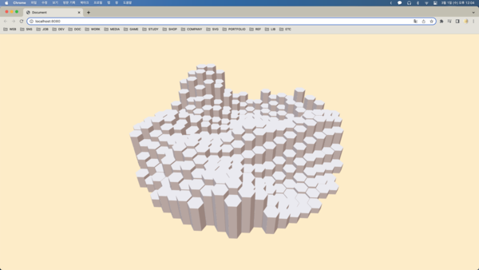

## Procedural Map

출처: [Three.js in practice - Procedural Map - tutorial for beginners 2022](https://youtu.be/HsCYEA_UuZA)

먼저 three.js 기본 Scene 설정을 해준다.

```js
const scene = new Scene();
scene.background = new Color("#FFEECC");

const camera = new PerspectiveCamera(45, innerWidth / innerHeight, 0.1, 1000);
camera.position.set(-17, 31, 33);

const renderer = new WebGLRenderer({ antialias: true });
renderer.setSize(innerWidth, innerHeight);
renderer.toneMapping = ACESFilmicToneMapping;
renderer.outputEncoding = sRGBEncoding;
renderer.physicallyCorrectLights = true;
// physicallyCorrectLights 설정을 통해 빛을 물리적으로 사실적이게 만들어준다.
document.body.appendChild(renderer.domElement);

(async function () {
  renderer.setAnimationLoop(() => {
    renderer.render(scene, camera);
  });
})();
```

그 후 OrbitControls를 추가해준다.

```js
const controls = new OrbitControls(camera, renderer.domElement);
controls.target.set(0, 0, 0);
// 컨트롤을 약하게 하기 위한 설정
controls.dampingFactor = 0.05;
controls.enableDamping = true;

// in AnimationLoop function
controls.update();
```

그 후 hexagon을 만드는 함수들을 선언해준다.

```js
// hexagon을 한개씩 그리면 성능이 저하되므로 하나의 hexagonGeometries에 계속 merge시켜 나간다.
let hexagonGeometries = new BoxGeometry(0, 0, 0);

function hexGeometry(height, position) {
  let geo = new CylinderGeometry(1, 1, height, 6, 1, false);
  geo.translate(position.x, height * 0.5, position.y);

  return geo;
}

function makeHex(height, position) {
  let geo = hexGeometry(height, position);
  hexagonGeometries = mergeBufferGeometries([hexagonGeometries, geo]);
}

// 타일간에 간격을 만들어주는 함수
function tileToPosition(tileX, tileY) {
  return new Vector2((tileX + (tileY % 2) * 0.5) * 1.77, tileY * 1.535);
}
```

Scene에 hexagon을 추가해준다.

```js
// in init function
let pmrem = new PMREMGenerator(renderer);
let envmapTexture = await new RGBELoader()
  .setDataType(FloatType)
  .loadAsync("assets/envmap.hdr");
envmap = pmrem.fromEquirectangular(envmapTexture).texture;

for (let i = -10; i <= 10; i++) {
  for (let j = -10; j <= 10; j++) {
    makeHex(3, tileToPosition(i, j));
  }
}
let hexagonMesh = new Mesh(
  hexagonGeometries,
  new MeshStandardMaterial({ envMap: envmap, flatShading: true })
);
scene.add(hexagonMesh);
```

다음과 같이 hexagon 타일이 만들어진 것을 확인할 수 있다.


---

hexagon 타일을 원형으로 만들어주기 위해 position이 일정 거리 이상이면 생성하지 않도록 만들어준다.

```js
for (let i = -10; i <= 10; i++) {
  for (let j = -10; j <= 10; j++) {
    let position = tileToPosition(i, j);

    if (position.length() > 16) continue;

    makeHex(3, tileToPosition(i, j));
  }
}
```

이후 랜덤한 노이즈를 주기 위해 simplex-noise 모듈을 설치한다.

```js
const MAX_HEIGHT = 10;

// in init function
const simplex = new SimplexNoise();

// modify loop
for (let i = -10; i <= 10; i++) {
  for (let j = -10; j <= 10; j++) {
    let position = tileToPosition(i, j);

    if (position.length() > 16) continue;

    let noise = (simplex.noise2D(i * 0.1, j * 0.1) + 1) * 0.5;
    noise = Math.pow(noise, 1.5);

    makeHex(noise * MAX_HEIGHT, tileToPosition(i, j));
  }
}
```

다음과 같이 원형이면서 랜덤한 높이의 hexagon 타일이 완성되었다.



---
