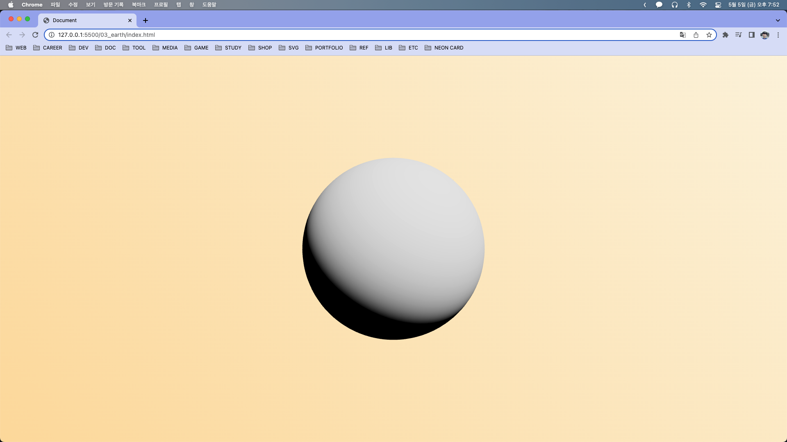

## Earth and planes

출처: [Three.js in practice - Earth and planes - tutorial for beginners 2022](https://youtu.be/wHjmwEcz4cM)

html에 밝은 배경과 어두운 배경을 만들고 어두운 배경은 opacity를 0으로 둔다.

기본 Three.js Scene을 설정하되 Renderer에 `alpha: true`옵션을 추가해 뒷배경이 보이도록 설정해준다.

구를 하나 추가해주고 OrbitsControl을 추가해준다. 다음과 같은 것을 볼 수 있다.



https://github.com/Domenicobrz/Threejs-in-practice/tree/main/three-in-practice-3/assets 의 에셋들을 다운받은 뒤, 구에 텍스처를 추가한다.

```js
let textures = {
  bump: await new TextureLoader().loadAsync("assets/earthbump.jpg"),
  map: await new TextureLoader().loadAsync("assets/earthmap.jpg"),
  spec: await new TextureLoader().loadAsync("assets/earthspec.jpg"),
};

let sphere = new Mesh(
  new SphereGeometry(10, 70, 70),
  new MeshPhysicalMaterial({
    map: textures.map,
    roughnessMap: textures.spec,
    bumpMap: textures.bump,
    bumpScale: 0.05,
    sheen: 1,
    sheenRoughness: 0.75,
    sheenColor: new Color("#ff8a00").convertSRGBToLinear(),
    clearcoat: 0.5,
  })
);
```

구에 지구 텍스처가 입혀졌다.


하지만 뒷편으로 돌리면 검은색만 나오기 때문에 environment map을 추가해줘야 한다.

```js
let pmrem = new PMREMGenerator(renderer);
let envmapTexture = await new RGBELoader()
  .setDataType(FloatType)
  .loadAsync("assets/old_room_2k.hdr");
let envMap = pmrem.fromEquirectangular(envmapTexture).texture;

let sphere = new Mesh(
  new SphereGeometry(10, 70, 70),
  new MeshPhysicalMaterial({
    ...,
    envMap,
    envMapIntensity: 0.4,
  })
);
sphere.rotation.y += Math.PI * 1.25;
```

envmap이 추가되어 검은 부분도 자연스러워지는 것을 볼 수 있다.


---

다음으로는 비행기를 띄워보겠다. 이전 링크에서 `plane/scene.glb` 파일과 `mask.png` 파일을 다운로드한 뒤 `GLTFLoader`를 이용하여 불러온다.

```js
let plane = (await new GLTFLoader().loadAsync("assets/plane/scene.glb")).scene
  .children[0];
let planesData = [makePlane(plane, textures.planeTrailMask, envMap, scene)];
```

비행기를 만드는 함수도 만들어준다.

```js
function makePlane(planeMesh, trailTexture, envMap, scene) {
  let plane = planeMesh.clone();
  plane.scale.set(0.001, 0.001, 0.001);
  plane.position.set(0, 0, 0);
  plane.rotation.set(0, 0, 0);
  plane.updateMatrixWorld();

  plane.traverse((object) => {
    if (object instanceof Mesh) {
      object.material.envMap = envMap;
      object.castShadow = true;
      object.receiveShadow = true;
    }
  });

  let group = new Group();
  group.add(plane);

  scene.add(group);

  return {
    group,
    yOff: 10.5 + Math.random() * 1.0,
  };
}
```

그 후 animationLoop에 추가해준다.

```js
planesData.forEach((planeData) => {
  let plane = planeData.group;

  plane.position.set(0, 0, 0);
  plane.rotation.set(0, 0, 0);
  plane.updateMatrixWorld();

  plane.translateY(planeData.yOff);
  plane.rotateOnAxis(new Vector3(1, 0, 0), +Math.PI * 0.5);
});
```

그런 뒤 확대해보면 비행기가 하나 떠있는 것을 발견할 수 있다.


비행기를 구 중심으로부터 랜덤한 yOffset으로 띄워놓았기 때문에 일정 구간을 돌도록 만들어주어야 한다.

먼저 makePlane 함수의 리턴에 다음을 추가해준다.

```js
return {
  group,
  rot: 0,
  rad: 0.5,
  yOff: 10.5 + Math.random() * 1.0,
};
```

이후 `Clock`으로 delta를 구해준다.

```js
let clock = new Clock();

renderer.setAnimationLoop(() => {
  let delta = clock.getDelta();
  ...
});
```

delta에 따라 y축으로 회전하고 그에 따라 x, z축도 회정하도록 만들어준다.

```js
planesData.forEach((planeData) => {
  let plane = planeData.group;

  plane.position.set(0, 0, 0);
  plane.rotation.set(0, 0, 0);
  plane.updateMatrixWorld();

  planeData.rot += delta * 0.25;
  plane.rotateOnAxis(new Vector3(0, 1, 0), planeData.rot);
  plane.rotateOnAxis(new Vector3(0, 0, 1), planeData.rad);
  plane.translateY(planeData.yOff);
  plane.rotateOnAxis(new Vector3(1, 0, 0), +Math.PI * 0.5);
});
```

일정 궤도를 회전하는 비행기가 완성되었다.


이제 비행기가 랜덤하게 움직이도록 값들을 추가해준다.

```js
// makePlane return statement
return {
  group,
  rot: Math.random() * Math.PI * 2.0,
  rad: Math.random() * Math.PI * 0.45 + 0.2,
  yOff: 10.5 + Math.random() * 1.0,
  randomAxis: new Vector3(nr(), nr(), nr()).normalize(),
  randomAxisRot: Math.random() * Math.PI * 2,
};

// nr function
function nr() {
  return Math.random() * 2 - 1;
}

// animation Loop
planesData.forEach((planeData) => {
  ...
  planeData.rot += delta * 0.25;
  plane.rotateOnAxis(planeData.randomAxis, planeData.randomAxisRot);
  ...
})
```

다음에는 비행기의 잔상(트레일)을 추가해보겠다. `makePlane`함수에 trail을 추가한다.

```js
let trail = new Mesh(
  new PlaneGeometry(1, 2),
  new MeshPhysicalMaterial({
    envMap,
    envMapIntensity: 3,

    // roughness: 0.4,
    // metalness: 0,
    // transmission: 1,

    transparent: true,
    opacity: 1,
    alphaMap: trailTexture,
  })
);
trail.rotateX(Math.PI);
trail.translateY(1.1);

...

group.add(trail);

...
```

비행기를 멈춰보면 트레일이 생긴 것을 볼 수 있다.


비행기들을 추가하고 원래대로 이동하도록 변경하면 다음과 같은 것을 볼 수 있다.


다음으로느 지구 주변의 원 효과를 위해 새로운 Scene과 카메라를 추가해준다.

```js
const ringScene = new Scene();

const ringCamera = new PerspectiveCamera(
  45,
  innerWidth / innerHeight,
  0.1,
  1000
);
ringCamera.position.set(0, 0, 50);
```

이전 Clock과 같이 ring을 세개 추가해주고 렌더링 함수에 ringScene도 렌더링하도록 만들어준다.

```js
renderer.autoClear = false;
renderer.render(ringScene, ringCamera);
renderer.autoClear = true;
```


---

마지막으로 낮과 밤을 만들어보겠다. 현재 light 외의 moonlight를 만들어 씬에 추가해준다. 그리고 animejs 모듈을 추가한다. 그 후 init 함수에 anime를 추가해준다.

```js
window.addEventListener("keypress", (e) => {
  if (e.key !== "j") return;

  anime({
    targets: sunBackground,
    opacity: [0, 1],
    easing: "easeInOutSine",
    duration: 500,
  });
});
```

이제 키보드의 J를 누르면 배경이 하얘지는 것을 볼 수 있다.


sphere과 plane에 intensity 속성을 추가한다.

```js
sphere.sunEnvIntensity = 0.4;
sphere.moonEnvIntensity = 0.1;

// makePlane function
object.sunEnvIntensity = 1;
object.moonEnvIntensity = 0.3;

trail.sunEnvIntensity = 3;
trail.moonEnvIntensity = 0.7;

// rings
ring1.sunOpacity = 0.35;
ring1.moonOpacity = 0.03;

ring2.sunOpacity = 0.35;
ring2.moonOpacity = 0.1;

ring3.sunOpacity = 0.35;
ring3.moonOpacity = 0.03;
```

마지막으로 anime를 수정한다 (조금 복잡할 수 있다.)

```js
let daytime = true;
let animating = false;

window.addEventListener("mousemove", (e) => {
  if (animating) return;

  let anim;
  if (e.clientX > innerWidth - 200 && !daytime) {
    anim = [1, 0];
  } else if (e.clientX < 200 && daytime) {
    anim = [0, 1];
  } else {
    return;
  }

  animating = true;

  let obj = { t: 0 };
  anime({
    targets: obj,
    t: anim,
    complete: () => {
      animating = false;
      daytime = !daytime;
    },
    update: () => {
      sunLight.intensity = 3.5 * (1 - obj.t);
      moonLight.intensity = 3.5 * obj.t;

      sunLight.position.setY(20 * (1 - obj.t));
      moonLight.position.setY(20 * obj.t);

      sphere.material.sheen = 1 - obj.t;

      scene.children.forEach((child) => {
        child.traverse((object) => {
          if (object instanceof Mesh && object.material.envMap) {
            object.material.envMapIntensity =
              object.sunEnvIntensity * (1 - obj.t) +
              object.moonEnvIntensity * obj.t;
          }
        });
      });

      ringScene.children.forEach((child, i) => {
        child.traverse((object) => {
          object.material.opacity =
            object.sunOpacity * (1 - obj.t) + object.moonOpacity * obj.t;
        });
      });

      sunBackground.style.opacity = 1 - obj.t;
      moonBackground.style.opacity = obj.t;
    },
    easing: "easeInOutSine",
    duration: 500,
  });
});
```

완성된 모습이다.


