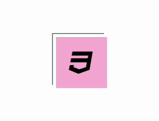

## Layered Effect

[[출처] CSS 3D Button Animation Tutorial - Layered Effect With CSS3 Transforms](https://youtu.be/eSgNxWCjFJw)



HTML구조

```html
<div class="button">
  <span></span>
  <span></span>
  <span><i class="fab fa-css3"></i></span>
  <span></span>
</div>
```

### 적용 원리 설명

- `.button`이 hover될 때 색을 흰색으로 바꿔준다.

- `.button`이 hover될 때 translate를 (-15px, -5px), rotateY를 -15deg, skewY를 -10deg 적용해준다. (초기값을 0으로 지정)

- 네번째 span에 translate를 (-4px, -4px)걸어주고 위와 왼쪽에 border를 1px준다.

- `.button`이 hover될 때 1, 2, 3번째 span을 우측하단으로 조금씩 이동시켜주고, 색을 지정해준다. (hover시 제일 뒤가 `.button`, 이후로 span 1, 2, 3, 4이다. 4번째 span은 테두리가 있고 투명하다)

- 네번째 span에 가상요소 `::before`, `::after`를 만들어준다. `::before`은 border-bottom이 있고 width가 0에서 hover될 때 100%가 된다. `::after`은 border-right가 있고 top이 100%에서 0%로, height가 0에서 100%로 transition된다. (네모가 그려지는 효과)

- 가상요소 hover 효과에 transition delay를 적절하게 걸어준다.
