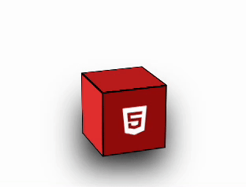

## 3D Transform Cube Menu

[[출처] CSS Animations 3D Transform Cube Menu Tutorial | Animated Buttons Hover Effect](https://youtu.be/J_W6njFDw1U)



HTML구조

```html
<div class="container">
  <div class="scene">
    <span class="cube_shadow"></span>
    <i class="fab fa-html5 icon_front"></i>
    <div class="cube">
      <div class="cube_face cube_face--front">
        <i class="fab fa-html5 icon_front"></i>
      </div>
      <div class="cube_face cube_face--back"></div>
      <div class="cube_face cube_face--right"></div>
      <div class="cube_face cube_face--left"></div>
      <div class="cube_face cube_face--top"></div>
    </div>
  </div>
</div>
```

### 적용 원리 설명

- 아이콘 하나는 큐브 정면에, 하나는 중앙 바닥에 위치시킨다. 중앙 바닥의 아이콘은 hover시 360도 회전하며 살짝 밑으로 이동한다.

- `.cube`를 translateZ를 -100px, rotateX를 -20deg rotateY를 20deg 로 transform한다. (`.scene`에 `perspective: 500px`주어야 translateZ를 적용할 수 있다.)

- `.cube`에 `transform-style: preserve-3d;`를 적용해 자식 노드들도 3d공간에 배치되도록 한다.

- 그림자를 만들어준다. blur 필터를 걸고 hover시에 height를 늘려준다.

- cube face들을 rotate와 translate를 통해 위치를 잡아주고 색들을 변경해준다.

- hover시 `.cube`를 translateY를 -40px translateZ를 -100px, rotateX를 30deg, rotateY를 30deg 잡아준다.
