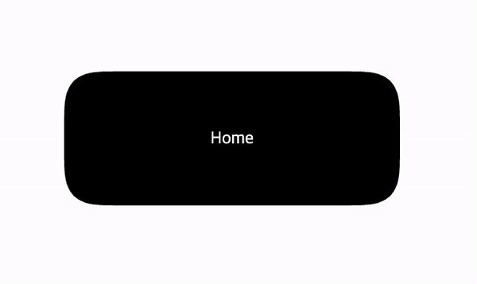

## Ripple Effect

[[출처] Amazing Pure CSS Ripple Animations Hover Effect on Buttons with HTML and Inline SVG](https://youtu.be/64NUjdMjEyw)



HTML구조

```html
<div class="container">
  <button>
    <span></span>
    <span></span>
    <span></span>
    <span></span>
    <span></span>
    <span></span>
    <span></span>
    <span></span>
    <span></span>
    <span></span>
    <span></span>
    <p>Home</p>
  </button>
</div>
```

### 적용 원리 설명

- 버튼의 span에 hover시 색 변경 효과를 넣는다.

- 버튼의 너비를 220px, 11개의 span 너비를 20px로 설정하고, 각각의 span의 left값을 조정하여 버튼의 크기와 같게 만든다.

- 가장자리 span일수록 transition-delay를 길게 걸어준다. (중앙에 위치한 span은 delay가 0)

- span에 cubic-bezier를 적용해준다 (`cubic-bezier(0.1, 1, 0.2, 4)`)

- Gausian Blur filter를 적용해준다.

filter html

```html
<svg>
  <defs>
    <filter id="goo">
      <feGaussianBlur stdDeviation="10" />
      <feColorMatrix
        values="1 0 0 0 0
                      0 1 0 0 0
                      0 0 1 0 0
                      0 0 0 60 -15 "
      />
      <feBlend in="SourceGraphic" />
    </filter>
  </defs>
</svg>
```
